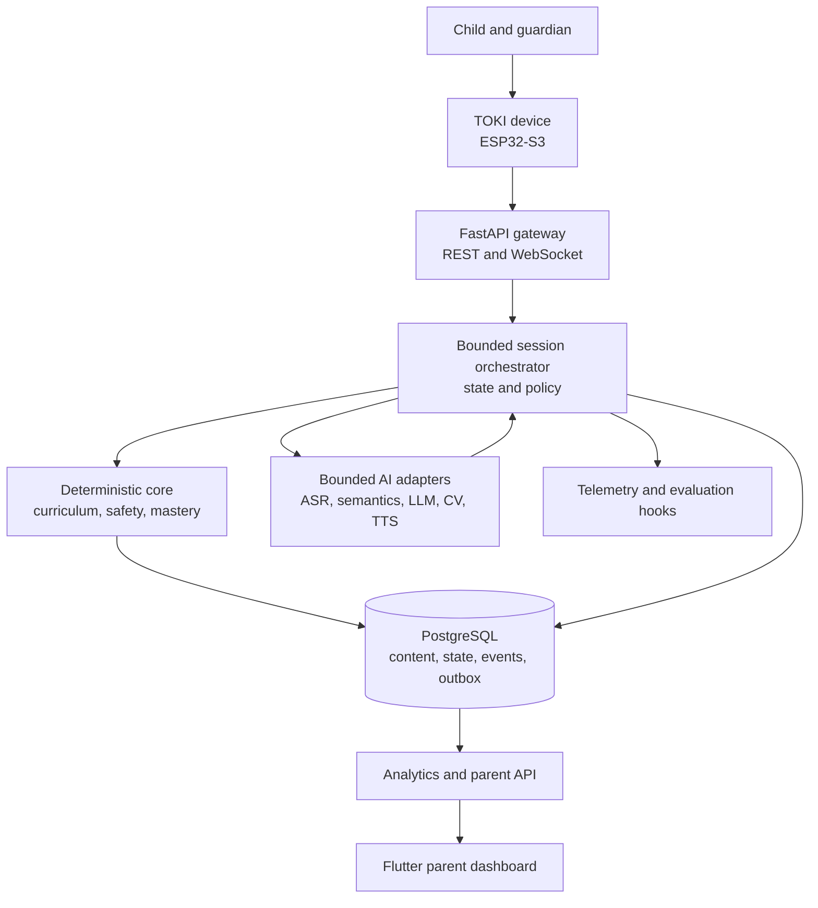
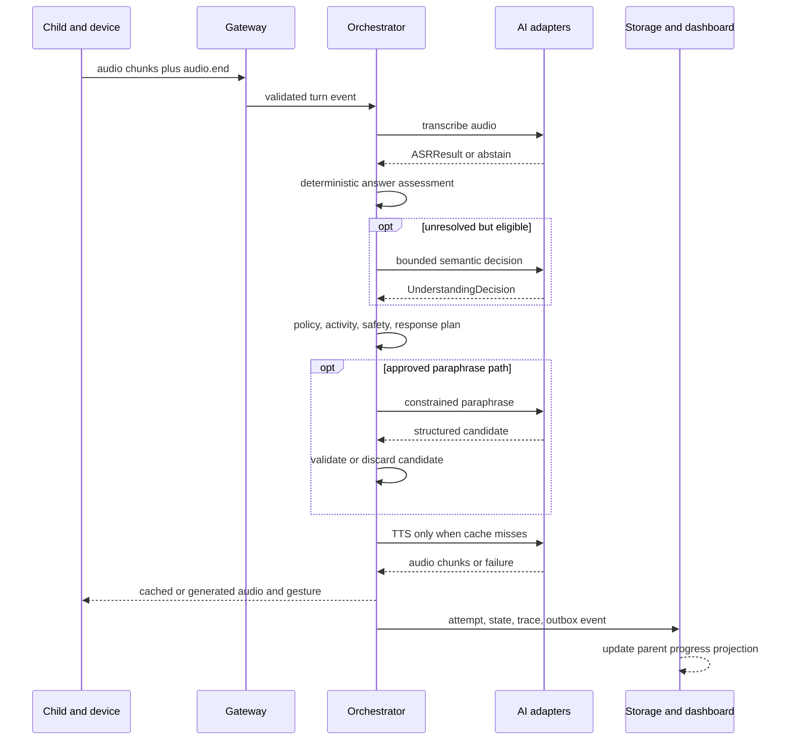
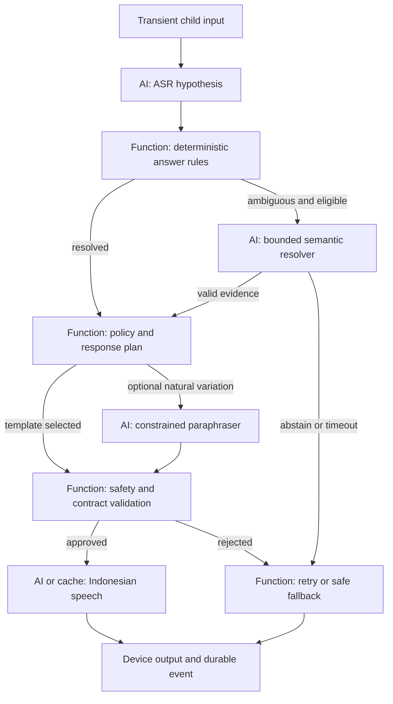

# TOKI Target Architecture 2026

**Architecture type:** Deterministic learning system enhanced by bounded AI  
**Competition:** LIDM 2026 — Inovasi Teknologi Digital Pendidikan  
**Implementation horizon:** final demonstration on 2–4 November 2026  
**Primary users:** Indonesian children aged approximately 3–6 under adult supervision  
**Primary engineering owner covered:** Backend & Conversational AI Developer  
**Status:** target design, not a description of the original proposal

---

## 1. Executive architecture decision

TOKI will be built as a **modular monolith with an explicit session state machine**, a structured and versioned curriculum, replaceable AI provider adapters, PostgreSQL persistence, and a thin ESP32-S3 device client.

The architecture deliberately separates two kinds of decisions:

- **Deterministic policy decisions:** what activity is active, which transitions are legal, what content is approved, whether a retry is allowed, how mastery changes, what is stored, and which fallback runs.
- **Probabilistic perception/language decisions:** what the child probably said, whether an unexpected phrase matches an approved answer, what approved object is visible, and how a selected response may be phrased naturally.

AI may provide evidence or wording. It does **not** control curriculum policy, safety escalation, persistence rules, device permissions, or session transitions.

There are **no runtime agents** in the target architecture. Every runtime task has a known input, bounded output, fixed tools, and explicit next state; a normal function or workflow is therefore simpler and more reliable than an agent.

### Winning technical story

> TOKI is not an unrestricted chatbot. It is a child-safe, curriculum-controlled learning companion whose AI components can abstain, whose decisions are traceable, and whose core activity continues when a model or the internet fails.

This design optimizes the competition outcome through:

1. an immediately demonstrable child interaction;
2. measurable end-to-end success and latency;
3. technically defensible AI usage;
4. visible safety, provenance, and explainability;
5. reliable hardware–backend–dashboard integration;
6. graceful degradation during a live demo.

---

## 2. Architectural principles and measurable constraints

| Principle | Architectural consequence | Acceptance signal |
|---|---|---|
| Curriculum before conversation | A selected activity and approved content constrain every child-facing turn | 100% of normal responses reference a valid curriculum version and content ID |
| Deterministic control, probabilistic evidence | AI results never directly mutate state | All AI outputs pass typed validation and a deterministic decision function |
| Uncertainty is not failure | ASR, semantics, and CV may return `ABSTAIN` | No low-confidence observation is recorded as a child error |
| Fail safely and visibly | Every dependency has a fallback | Failure-injection suite always reaches a safe state |
| Optimize p95, not averages | Each stage has a deadline and trace span | Speech endpoint to first audible response meets the validated p95 target, aiming for ≤3 seconds |
| Minimal child data | Derived learning events are stored; raw media is ephemeral by default | No raw audio/video or direct child identifiers in normal logs |
| One deployable backend | Components are code modules inside one service until scaling proves otherwise | One tested container runs in cloud and on the demo laptop |
| Evidence over feature count | Optional AI is enabled only after beating a baseline | Every enabled AI component has a frozen evaluation result |

---

## 3. System boundary

### 3.1 Inside the TOKI system

The target system includes:

- ESP32-S3 device firmware and device I/O protocol;
- microphone input, speaker output, button/wake interaction, OLED/LED/servo commands, and triggered camera snapshots;
- FastAPI REST and WebSocket gateway;
- session orchestrator and deterministic state machine;
- activity/curriculum engine;
- speech ingestion, ASR adapter, and endpointing integration;
- deterministic answer assessment and optional semantic resolver;
- constrained response planning and optional LLM paraphrasing;
- deterministic safety policy and reviewed escalation responses;
- TTS adapter and cached audio asset service;
- triggered object-detection adapter;
- rule-based mastery and next-activity selection;
- PostgreSQL transactional data, append-only domain events, and outbox;
- parent-facing progress API consumed by the Flutter application;
- telemetry, evaluation hooks, health checks, configuration, and feature flags;
- cloud deployment and local demo-twin deployment.

### 3.2 External actors and dependencies

| External party/system | Interaction with TOKI | Trust assumption |
|---|---|---|
| Child | Speaks, responds, handles objects, sees/hears feedback | Input is unpredictable; never treated as an authenticated command source |
| Parent/guardian | Grants consent, configures child profile, reviews progress | Authenticated adult account controls consent and retention |
| PAUD/psychology reviewer | Approves curriculum, safety language, and evaluation rubric | Content becomes usable only after explicit approval/versioning |
| Team operator | Provisions devices, releases content/models, monitors health | Privileged role with audit logging |
| Managed ASR provider | Converts streamed Indonesian speech to hypotheses | Untrusted probabilistic output; may timeout or be wrong |
| Managed LLM provider | Resolves bounded ambiguity or paraphrases approved response plans | Untrusted probabilistic output; no direct state or tool access |
| Managed TTS provider | Produces dynamic Indonesian audio | May timeout; output must have cached fallback |
| Cloud platform | Runs API container and database networking | May be unavailable at venue; local demo twin is required |

### 3.3 Explicitly outside the boundary

TOKI does not provide:

- diagnosis, therapy, clinical scoring, or medical advice;
- unrestricted general conversation or web access;
- direct autonomous interaction without adult oversight;
- face recognition, identity inference, or speaker identification;
- emotion inference presented as ground truth;
- continuous audio/video surveillance or default raw-media retention;
- automated curriculum publication without expert approval;
- autonomous model training from live child interactions;
- payments, social networking, advertising, or third-party behavioral tracking.

---

## 4. System architecture diagram



### Architectural style

The backend is a **modular monolith**, not microservices. Modules have explicit interfaces and can later be extracted, but one process/container minimizes network hops, deployment work, distributed tracing complexity, and demo failure points.

Recommended Python package boundaries:

```text
app/
  api/                 REST and WebSocket endpoints
  device_protocol/     envelopes, sequencing, acknowledgements
  sessions/            orchestrator and state transitions
  curriculum/          content lookup and activity rules
  understanding/       ASR result handling and answer assessment
  response/            response plan, templates, optional paraphrasing
  safety/              policy engine and escalation catalog
  speech/              ASR/TTS provider adapters and audio cache
  vision/              triggered CV adapter and threshold policy
  mastery/             learning evidence and progression rules
  analytics/           parent-facing projections
  persistence/         repositories, transactions, outbox, migrations
  telemetry/           traces, metrics, redaction
  evaluation/          replay adapters and test fixtures
```

---

## 5. Major components and responsibilities

| Component | Primary responsibilities | Type | Failure containment |
|---|---|---|---|
| Device runtime | Audio capture/playback, local AEC/NS/VAD, input button/wake, camera snapshot, display/gesture commands, local cache, reconnect | Deterministic embedded workflow | Can play cached prompt and show reconnect state without backend |
| Device protocol gateway | Authenticate device, validate envelope, order/deduplicate events, acknowledge messages, resume sessions | Deterministic | Reject malformed or replayed frames; never forward unvalidated input |
| Session orchestrator | Own current state, deadlines, retry counters, legal transitions, command sequencing | Deterministic | AI/provider failure becomes an explicit event and fallback transition |
| Curriculum service | Load approved module/skill/activity/item/version, answer specification, hints, templates | Deterministic | Retrieval miss returns typed `CONTENT_NOT_FOUND`; never asks LLM for facts |
| Activity selector | Rank eligible next activities from mastery, exposure, age band, and session constraints | Deterministic | Falls back to configured default activity for the module |
| Speech ingestion | Accept chunks, validate codec/rate, track turn audio, close stream after device VAD/end event | Deterministic | Invalid audio causes one controlled retry, not a crash |
| ASR adapter | Call selected ASR provider and normalize hypotheses | AI adapter | Deadline, circuit breaker, provider fallback, then offline-friendly activity |
| Answer assessor | Compare transcript to expected phrases, synonyms, phonetic variants, and semantic classes | Deterministic first | Low evidence becomes `UNCERTAIN`, never `INCORRECT` |
| Semantic resolver | Resolve only answers not decided by deterministic rules into a fixed schema | AI, bounded | Timeout/invalid schema becomes `ABSTAIN` |
| Response planner | Select pedagogical act, content IDs, gesture, question expectation, and fallback asset | Deterministic | Always produces a template-backed response plan |
| LLM paraphraser | Optionally make an approved response plan more natural within strict limits | AI, bounded and bypassable | Invalid/unsafe/slow output is discarded and template is used |
| Safety policy engine | Validate input class, state, content provenance, output constraints, escalation class | Deterministic primary | Fails closed to reviewed canned audio |
| Audio renderer | Resolve cached asset or request dynamic TTS; chunk audio for device | Deterministic routing + AI TTS | Cache and canned asset are always available |
| Object vision adapter | Classify requested snapshot against current activity's curated vocabulary | AI, asynchronous | `UNKNOWN`/timeout does not block conversation |
| Attention proxy | Optional face-present/head-orientation temporal features | AI-derived heuristic | No result has no effect; never stores an emotional label |
| Mastery engine | Convert validated attempts into evidence, update transparent skill state, explain change | Deterministic | Versioned rules; transaction rollback preserves prior mastery |
| Persistence layer | Transactions, repositories, migrations, append-only events, outbox | Deterministic | Idempotent writes and transactional consistency |
| Analytics projector | Convert domain events into parent-safe progress summaries | Deterministic asynchronous workflow | Rebuildable from event log; does not block child turn |
| Parent API | Authenticated consent, profile, progress, session summary endpoints | Deterministic | No model calls on critical read path |
| Observability layer | Correlated traces, stage latency, errors, fallback counts, version metadata | Deterministic instrumentation | Asynchronous export; telemetry failure does not fail a turn |
| Evaluation harness | Replay audio/events, inject dependency failures, compare releases to frozen gold sets | Deterministic workflow invoking AI adapters | Runs outside child production sessions |

### Ownership boundary for Backend & Conversational AI

The backend owner should directly own:

- API and WebSocket contracts;
- session orchestrator and state machine;
- database schema, repositories, event/outbox behavior;
- ASR, semantic resolver, LLM, safety, and TTS adapters;
- response planning and fallback behavior;
- parent progress API contracts;
- telemetry and evaluation replay integration.

Cross-team interfaces must be frozen early for:

- hardware firmware and audio/camera formats;
- CV input/output contract and threshold calibration;
- Flutter authentication and progress DTOs;
- curriculum schema and expert approval workflow;
- mastery/BKT ownership. The target architecture assigns initial rule-based mastery to the backend domain because it consumes backend attempt events, but pedagogical parameters require expert approval.

---

## 6. Major data flow



### Data-flow rules

1. Audio is a transient turn artifact, not the source of learning truth.
2. `ASRResult` is evidence. It cannot directly mark an answer correct or incorrect.
3. `UnderstandingDecision` is also evidence. The deterministic assessor/policy produces the final `AttemptAssessment`.
4. The response planner operates on approved curriculum content and the current state.
5. LLM output is a candidate. It becomes child-facing only after schema, provenance, language, length, and safety validation.
6. Learning evidence is persisted only after the attempt is resolved.
7. Analytics projection is asynchronous and outside the audio response critical path.
8. Vision observations arrive independently and are usable only if fresh, sufficiently confident, and requested by the current activity.

---

## 7. Control flow and state management

### 7.1 Authoritative state

The session orchestrator owns a `SessionSnapshot` containing:

- `session_id`, `device_id`, pseudonymous `child_id`;
- `state` and `state_version`;
- active `curriculum_version`, `module_id`, `activity_id`, `item_id`;
- current `turn_id` and expected input type;
- retry counts for speech, provider, and device delivery;
- last acknowledged device sequence;
- selected skill/mastery band;
- safety mode and guardian restrictions;
- recent activity/content IDs to prevent repetition;
- deadlines and timestamps;
- enabled feature flags and provider versions.

The in-process copy is a performance cache. PostgreSQL is authoritative after each accepted transition. Use optimistic concurrency through `state_version`; an update succeeds only if the previous version matches.

### 7.2 State machine

```text
IDLE
  → SESSION_STARTING
  → GREETING
  → ACTIVITY_SELECTING
  → PROMPTING
  → LISTENING
  → INTERPRETING
  → FEEDBACK_PLANNING
  → RESPONDING
  → MASTERY_UPDATING
  → ACTIVITY_SELECTING or SESSION_ENDING
  → COMPLETED
```

Exceptional states are explicit:

```text
NO_SPEECH
LOW_UNDERSTANDING_CONFIDENCE
CONTENT_ERROR
SAFETY_ESCALATION
DEVICE_DISCONNECTED
DEPENDENCY_DEGRADED
SESSION_ABORTED
```

### 7.3 Transition table

| Current state | Accepted event | Guard | Next state | Deadline | Fallback |
|---|---|---|---|---:|---|
| `IDLE` | `session.start` | device authenticated, consent active | `SESSION_STARTING` | 2 s | deny with typed reason |
| `SESSION_STARTING` | internal load complete | approved curriculum exists | `GREETING` | 1 s | cached default module |
| `GREETING` | audio delivered | device ACK received | `ACTIVITY_SELECTING` | 4 s | resend once, then reconnect |
| `ACTIVITY_SELECTING` | eligible activity selected | activity/version valid | `PROMPTING` | 100 ms | default activity |
| `PROMPTING` | prompt audio delivered | expected reply registered | `LISTENING` | 4 s | cached prompt |
| `LISTENING` | `audio.end` | valid audio metadata | `INTERPRETING` | child-dependent | `NO_SPEECH` |
| `INTERPRETING` | attempt resolved | confidence policy passed | `FEEDBACK_PLANNING` | 1.3 s | `LOW_UNDERSTANDING_CONFIDENCE` |
| `FEEDBACK_PLANNING` | response validated | content/provenance/safety valid | `RESPONDING` | 700 ms | template/canned response |
| `RESPONDING` | device ACK | audio/gesture delivered | `MASTERY_UPDATING` | 4 s | resend once, persist undelivered |
| `MASTERY_UPDATING` | transaction committed | evidence is eligible | `ACTIVITY_SELECTING` or `SESSION_ENDING` | 150 ms | keep prior mastery, record error |
| any active state | high-severity safety event | deterministic policy match | `SAFETY_ESCALATION` | immediate | canned reviewed escalation |
| any active state | guardian/device stop | valid stop source | `SESSION_ENDING` | immediate | local stop command |

### 7.4 Control-flow invariants

- One active child turn per session.
- Only the orchestrator advances session state.
- Provider callbacks carry `session_id`, `turn_id`, and expected `state_version`; stale results are discarded.
- A CV result never changes mastery directly.
- Low ASR/semantic confidence never maps to `INCORRECT`.
- High-severity safety policies override curriculum flow.
- A generated response is never played before deterministic validation.
- Every state has a bounded exit path.
- A reconnect resumes from the last durable, device-acknowledged state.

---

## 8. AI and agent workflow



### Why there is no agent node

An agent is justified when a model must autonomously choose goals, select among changing tools, plan multiple steps, inspect results, and revise its plan. TOKI's runtime has none of those requirements:

- the active goal is already defined by the curriculum activity;
- allowed operations are fixed;
- control transitions are known in advance;
- content and safety must remain bounded;
- retries and fallbacks must be predictable;
- latency must be tightly controlled.

Therefore, replacing functions with agents would reduce reliability without increasing useful capability.

### Agent justification audit

| Candidate “agent” | Does it need autonomy? | Target decision | Why |
|---|---:|---|---|
| Conversation agent | No | Normal state-machine workflow | The activity fixes goal, inputs, valid actions, and next states |
| Intent agent | No | Classifier/function | Output is one fixed enum with confidence |
| Retrieval agent | No | SQL repository function | Search space and filters are known from activity metadata |
| Safety agent | No | Deterministic policy engine | Safety must be reproducible and fail closed |
| TTS agent | No | Provider adapter | One input text produces one output audio stream |
| Vision agent | No | Model adapter | One snapshot and fixed label set produce bounded observations |
| Adaptive-learning agent | No | Rule-based decision function | Progression policy must be explainable and versioned |
| Curriculum-authoring agent | Potentially, later | **DO NOT BUILD before competition** | Offline iterative authoring could use tools, but expert approval remains the bottleneck and runtime value is indirect |
| Evaluation agent | No | Deterministic replay/evaluation workflow | Frozen cases, assertions, and expected metrics are known |

**Runtime agent count: zero.**

---

## 9. AI component responsibilities and necessity

### 9.1 ASR

**Responsibility:** convert Indonesian child audio into one or more text hypotheses with timing/status metadata.

**Why AI is necessary:** preschool speech is variable and cannot be mapped to text using deterministic signal processing or a keyword table alone. Learned acoustic/language models are necessary for natural spoken interaction.

**Boundaries:**

- ASR does not score learning;
- provider confidence is not accepted as truth;
- the adapter must normalize vendor output;
- it may return `ABSTAIN`;
- selection between managed ASR and faster-whisper is benchmark-driven.

**Target interface:** `transcribe(AudioTurn, ASRContext) -> ASRResult`.

### 9.2 Semantic answer resolver

**Responsibility:** determine whether an otherwise unresolved transcript semantically matches one of the activity's approved answer concepts.

**Why AI is necessary:** a child may use an unlisted synonym, incomplete natural phrase, or ASR-corrupted paraphrase that deterministic exact/phonetic matching cannot resolve reliably.

**Why it is not always invoked:** most activity answers have small expected vocabularies. Rules are cheaper, faster, and more reproducible. The semantic model is only valuable on the ambiguous remainder.

**Boundaries:** fixed candidate concept IDs, no open answer generation, structured output, confidence plus rationale code, and `ABSTAIN` allowed.

### 9.3 Constrained LLM paraphraser

**Responsibility:** produce a short natural Indonesian variation of an already-approved pedagogical response plan.

**Why AI is useful but not strictly necessary:** templates can complete every activity, but limited variation makes repeated sessions feel robotic. The LLM can improve naturalness and perceived personalization without deciding facts or pedagogy.

**Target priority:** SHOULD HAVE only after the deterministic core works.

**Boundaries:**

- no web/tools/memory;
- approved fact and content IDs supplied explicitly;
- ≤25 spoken words, one concept, at most one question;
- low temperature;
- typed output;
- deterministic validator;
- template fallback.

### 9.4 Neural TTS

**Responsibility:** synthesize supported Indonesian speech for dynamic, validated text.

**Why AI is necessary for dynamic speech:** natural, intelligible synthesis for arbitrary approved wording requires a learned TTS model. However, most fixed prompts do not require runtime AI and should use pre-generated assets.

**Boundaries:** cached audio first; dynamic TTS only for approved text; no unsupported XTTS-v2 dependency.

### 9.5 Object detector

**Responsibility:** identify whether one of the activity's approved object labels is present in a triggered snapshot.

**Why AI is necessary:** object appearance varies by viewpoint, lighting, size, and background; deterministic image rules are not robust enough.

**Target priority:** SHOULD HAVE as the strongest multimodal differentiator, but it must remain off the speech critical path.

**Boundaries:** curated label vocabulary, calibrated threshold, `UNKNOWN`, no unrestricted scene narration, no face identification, no continuous upload.

### 9.6 Attention proxy

**Responsibility:** derive conservative face-presence/head-orientation features over time.

**Why AI may be useful:** landmark models can robustly locate a face/head across normal visual variation better than hand-coded pixel rules.

**Why it is optional:** the signal is not reliable evidence of internal engagement and may not improve the learning loop. It is NICE TO HAVE only after measurable validation.

**Boundaries:** no emotional label, no diagnosis, no direct mastery update, and no child-facing correction based solely on the proxy.

### 9.7 Components that must remain deterministic

The following must not be delegated to a model:

- session state and legal transitions;
- activity eligibility and retry limits;
- consent and retention policy;
- curriculum facts and content approval;
- safety escalation selection;
- output length/lexicon/provenance validation;
- learning evidence eligibility;
- mastery update arithmetic;
- database transactions and idempotency;
- device permissions and commands;
- dashboard aggregation definitions;
- release gates.

---

## 10. Model responsibility matrix

| Capability | Primary candidate | Backup/baseline | Input | Output | Runtime deadline | Release criterion |
|---|---|---|---|---|---:|---|
| Indonesian child ASR | Best managed provider from blind test | faster-whisper on demo laptop or alternate managed provider | 16 kHz mono speech turn + expected vocabulary hints | `ASRResult` | 900 ms after endpoint target | best concept accuracy and acceptable p95 on device-recorded set |
| Semantic resolution | Pinned low-latency structured-output LLM | deterministic rules only | transcript + fixed candidate concepts | `UnderstandingDecision` | 500 ms | improves ambiguous-case macro F1 without harming abstention precision |
| Paraphrasing | Pinned Gemini Flash/Flash-Lite class model | approved template | response plan + approved facts | `ParaphraseCandidate` | 600 ms | human naturalness gain; 100% schema/provenance/safety gate |
| TTS | Supported `id-ID` managed neural voice | pre-generated/cached audio | validated short Indonesian text | audio stream | first chunk 450 ms | expert/parent intelligibility and voice preference plus p95 |
| Object detection | YOLO-World with fixed vocabulary or validated closed-set model | `UNKNOWN` and verbal child description | triggered JPEG snapshot + allowed labels | `VisionObservation` | asynchronous, 1.5 s | per-class metrics and low unknown false-positive rate |
| Attention proxy | MediaPipe face/head landmarks | no signal | sampled frames | neutral temporal features | asynchronous | inter-rater agreement and proven activity benefit |

Model names, provider versions, prompts, thresholds, and feature flags are configuration data. They must be pinned for the final release and recorded on every trace.

---

## 11. APIs and interfaces

### 11.1 Public REST API

| Method and path | Consumer | Purpose | Notes |
|---|---|---|---|
| `POST /v1/devices/register` | provisioning tool | Bind device to guardian/account | one-time code; rotate device credential |
| `POST /v1/device-sessions` | device | Start session and fetch negotiated capabilities | verifies consent and curriculum version |
| `POST /v1/device-sessions/{id}/resume` | device | Resume after reconnect | requires last ACK sequence and state version |
| `POST /v1/device-sessions/{id}/stop` | device/guardian | Stop safely | idempotent |
| `GET /v1/devices/{id}/configuration` | device | Fetch non-secret runtime config | ETag/versioned |
| `GET /v1/audio-assets/{asset_id}` | device | Fetch approved cached audio | signed/authorized, content hash |
| `POST /v1/vision/observations` | CV worker/device gateway | Submit bounded observation | activity/turn correlation required |
| `GET /v1/children/{id}/progress` | Flutter | Read parent-safe progress projection | guardian authorization required |
| `GET /v1/children/{id}/sessions` | Flutter | Session summaries | no raw transcripts by default |
| `PUT /v1/children/{id}/preferences` | Flutter | Update allowed preferences | optimistic concurrency |
| `POST /v1/consents` | Flutter | Record guardian consent | version and scope required |
| `POST /v1/consents/{id}/revoke` | Flutter | Revoke future processing | idempotent and audited |
| `GET /health/live` | platform | Process liveness | no external calls |
| `GET /health/ready` | platform/operator | DB/content readiness | bounded checks |
| `GET /health/demo` | operator | Verify demo dependencies and caches | authenticated; reports degraded modes |

### 11.2 Device WebSocket

Endpoint:

```text
wss://<host>/v1/device-sessions/{session_id}/stream
```

Client-to-server control message types:

- `device.hello`
- `device.heartbeat`
- `audio.start`
- binary audio frame
- `audio.end`
- `output.ack`
- `camera.frame.ready`
- `device.error`
- `session.stop`

Server-to-client message types:

- `session.accepted`
- `listen.start`
- `listen.stop`
- `output.audio.start`
- binary audio frame
- `output.audio.end`
- `device.expression`
- `camera.capture.request`
- `session.resume.state`
- `error`
- `session.end`

### 11.3 Internal interfaces

```python
class ASRProvider:
    async def transcribe(self, turn: AudioTurn, context: ASRContext) -> ASRResult: ...

class SemanticResolver:
    async def resolve(self, request: SemanticResolutionRequest) -> UnderstandingDecision: ...

class CurriculumRepository:
    async def get_activity(self, activity_id: str, version: str) -> ActivityDefinition: ...
    async def select_candidates(self, query: ActivityEligibility) -> list[ActivityDefinition]: ...

class SafetyPolicy:
    def inspect_input(self, context: TurnContext) -> SafetyDecision: ...
    def validate_response(self, plan: ResponsePlan) -> SafetyDecision: ...

class TTSProvider:
    async def synthesize(self, request: TTSRequest) -> AsyncIterator[AudioChunk]: ...

class VisionProvider:
    async def detect(self, request: VisionRequest) -> VisionObservation: ...

class MasteryPolicy:
    def update(self, current: MasteryState, evidence: LearningEvidence) -> MasteryUpdate: ...
```

Provider-specific SDK objects must not escape their adapter modules.

---

## 12. Structured data contracts

All contracts use Pydantic models, emit JSON Schema, include `schema_version`, and reject unknown enum values. The database stores the schema/model/prompt/curriculum versions needed to reproduce a decision.

### 12.1 Common device envelope

```json
{
  "schema_version": "1.0",
  "type": "audio.end",
  "message_id": "01J...",
  "device_id": "TOKI-041",
  "session_id": "uuid",
  "turn_id": "uuid",
  "seq": 42,
  "occurred_at": "2026-09-06T10:00:00Z",
  "payload": {
    "duration_ms": 1840,
    "codec": "pcm_s16le",
    "sample_rate_hz": 16000,
    "vad_reason": "silence_timeout"
  }
}
```

Validation invariants:

- `seq` is monotonic per connection/session;
- `message_id` is idempotent;
- `turn_id` must equal the session's active turn;
- codec/sample rate must match negotiated capability;
- duration and payload size have hard limits;
- stale or future state versions are rejected.

### 12.2 ASR result

```json
{
  "schema_version": "1.0",
  "status": "FINAL",
  "transcript": "itu kucing",
  "alternatives": ["itu kucing", "itu kuncing"],
  "language": "id-ID",
  "provider": "configured-provider",
  "model_version": "pinned-version",
  "provider_confidence": null,
  "audio_quality": "ACCEPTABLE",
  "latency_ms": 612
}
```

`status` is one of `FINAL`, `NO_SPEECH`, `UNSTABLE`, `ABSTAIN`, `ERROR`. Provider confidence remains optional because it is not universally calibrated.

### 12.3 Understanding decision

```json
{
  "schema_version": "1.0",
  "decision": "MATCH",
  "concept_id": "ANIMAL_CAT",
  "intent": "ANSWER_ACTIVITY",
  "confidence_band": "HIGH",
  "evidence_codes": ["SEMANTIC_EQUIVALENCE", "EXPECTED_CONTEXT"],
  "model_version": "pinned-version"
}
```

Allowed `decision`: `MATCH`, `NO_MATCH`, `OFF_TOPIC`, `SAFETY_RELEVANT`, `ABSTAIN`.

### 12.4 Activity definition

```json
{
  "schema_version": "1.0",
  "activity_id": "ACT-ANIMAL-03",
  "curriculum_version": "2026.09.1",
  "module_id": "ANIMALS",
  "skill_id": "NAME_COMMON_ANIMAL",
  "difficulty": "EASY",
  "prompt_content_id": "CONTENT-181",
  "expected_reply_type": "WORD_OR_SHORT_PHRASE",
  "answer_spec": {
    "concept_ids": ["ANIMAL_CAT"],
    "accepted_phrases": ["kucing", "itu kucing"],
    "phonetic_variants": [],
    "allow_semantic_resolution": true
  },
  "hint_content_ids": ["CONTENT-182", "CONTENT-183"],
  "max_child_retries": 1,
  "review_status": "APPROVED"
}
```

### 12.5 Response plan

```json
{
  "schema_version": "1.0",
  "session_id": "uuid",
  "turn_id": "uuid",
  "pedagogical_act": "POSITIVE_FEEDBACK",
  "template_text": "Hebat! Itu kucing. Yuk, tirukan suara kucing.",
  "candidate_text": null,
  "final_text": "Hebat! Itu kucing. Yuk, tirukan suara kucing.",
  "audio_asset_fallback_id": "AUDIO-551",
  "emotion_expression": "HAPPY",
  "gesture": "NOD_ONCE",
  "expects_reply": true,
  "provenance": {
    "curriculum_version": "2026.09.1",
    "content_ids": ["CONTENT-184"]
  },
  "safety_action": "ALLOW",
  "expires_ms": 8000
}
```

The field `emotion_expression` describes TOKI's device expression, not an inferred child emotion.

### 12.6 Learning evidence and mastery update

```json
{
  "schema_version": "1.0",
  "attempt_id": "uuid",
  "skill_id": "NAME_COMMON_ANIMAL",
  "outcome": "CORRECT",
  "independence": "WITHOUT_HINT",
  "understanding_reliability": 0.91,
  "eligible_for_mastery": true,
  "evidence_score": 0.91,
  "reason_codes": ["EXPECTED_PHRASE_MATCH"]
}
```

```json
{
  "schema_version": "1.0",
  "skill_id": "NAME_COMMON_ANIMAL",
  "policy_version": "RULE-MASTERY-1.0",
  "previous_score": 0.55,
  "new_score": 0.66,
  "band": "DEVELOPING",
  "next_action": "REVIEW_LATER",
  "explanation_codes": ["INDEPENDENT_SUCCESS", "SECOND_SESSION_EVIDENCE"]
}
```

### 12.7 Vision observation

```json
{
  "schema_version": "1.0",
  "status": "DETECTED",
  "object_id": "ANIMAL_CAT_TOY",
  "label": "boneka kucing",
  "confidence": 0.87,
  "allowed_vocabulary_version": "OBJ-2026.09.1",
  "captured_at": "2026-09-06T10:00:03Z",
  "expires_at": "2026-09-06T10:00:08Z",
  "model_version": "pinned-version"
}
```

Allowed status: `DETECTED`, `UNKNOWN`, `NO_OBJECT`, `LOW_QUALITY`, `ABSTAIN`, `ERROR`.

### 12.8 Safety decision

```json
{
  "schema_version": "1.0",
  "action": "USE_CANNED_ESCALATION",
  "severity": "HIGH",
  "policy_code": "PHYSICAL_DANGER",
  "response_content_id": "SAFETY-011",
  "notify_guardian": true,
  "allow_generation": false,
  "policy_version": "CHILD-SAFETY-1.0"
}
```

### 12.9 Error envelope

```json
{
  "schema_version": "1.0",
  "error_id": "uuid",
  "code": "ASR_TIMEOUT",
  "category": "DEPENDENCY",
  "retryable": true,
  "user_action": "REPEAT_ONCE",
  "fallback_action": "USE_CHOICE_PROMPT",
  "trace_id": "hex",
  "safe_message_asset_id": "AUDIO-RETRY-01"
}
```

Never send stack traces, provider payloads, credentials, or internal prompts to the device or Flutter app.

---

## 13. Storage architecture

### 13.1 Primary storage

Use one managed PostgreSQL database in cloud and PostgreSQL in the local demo profile.

Core tables:

| Table group | Tables | Notes |
|---|---|---|
| Identity/consent | `guardian_account`, `child_profile`, `consent_record`, `device` | pseudonymous child profile; audit consent changes |
| Curriculum | `curriculum_version`, `module`, `skill`, `activity`, `item`, `content`, `audio_asset`, `answer_spec` | approved versions are immutable |
| Runtime | `session`, `session_snapshot`, `turn`, `attempt`, `vision_observation` | optimistic state version; no raw media by default |
| Adaptation | `mastery_state`, `mastery_history`, `ex_policy_version` | every update retains explanation and policy version |
| AI audit | `model_run`, `prompt_version`, `provider_release` | metadata, latency, status; redact child text |
| Eventing | `domain_event`, `outbox_event`, `consumer_checkpoint` | append-only event and reliable projection |
| Analytics | `child_progress_projection`, `session_summary_projection` | rebuildable parent-safe read models |
| Operations | `device_health`, `release_manifest`, `feature_flag_snapshot` | supports preflight and reproduction |

### 13.2 Transaction boundaries

One accepted child attempt transaction writes:

1. `turn` resolution;
2. `attempt` and learning evidence;
3. `mastery_state` plus history if eligible;
4. next `session_snapshot` version;
5. append-only `domain_event`;
6. `outbox_event` for analytics projection.

If any write fails, all six roll back. The child can still receive the already-planned response, but the system records/replays a bounded persistence repair event without inventing mastery changes.

### 13.3 Media handling

- Audio lives in bounded memory or encrypted temporary storage for the current turn and is deleted after resolution.
- Camera frames are deleted after the bounded vision result.
- Fixed/generated approved TTS assets may be retained because they contain no child media.
- Research retention requires separate guardian consent, separate storage, access control, encryption, and expiry.
- Logs store hashes, reason codes, durations, and redacted features—not raw child media.

### 13.4 Vector storage decision

Do not create a vector database for the competition target. If future evaluation shows semantic retrieval is necessary, add pgvector to the same PostgreSQL database with explicit metadata filters and a retrieval benchmark. It is not on the critical build path.

---

## 14. Error handling, retries, and fallbacks

### 14.1 Error taxonomy

| Category | Examples | Owner | Default behavior |
|---|---|---|---|
| Validation | malformed envelope, unsupported codec, invalid schema | gateway/orchestrator | reject, log reason, safe device instruction |
| User-input uncertainty | no speech, noise, ambiguous answer | understanding | one child-friendly retry, then choice/hint |
| Dependency | ASR/LLM/TTS timeout, provider 5xx | adapter | deadline, circuit breaker, alternate provider/cache |
| Content | missing activity/content/audio | curriculum | default approved activity/template |
| Concurrency | stale callback/state version, duplicate seq | orchestrator | discard/de-duplicate; never repeat state mutation |
| Persistence | transaction failure, DB unavailable | persistence | rollback, bounded buffer, degraded session/end safely |
| Device | disconnect, audio playback error, camera failure | device gateway | reconnect/resume or continue without optional modality |
| Safety | dangerous phrase, private-data request, policy violation | safety engine | immediate canned escalation and state override |
| Internal defect | unhandled exception/invariant violation | global handler | correlation ID, fail closed, stop or safe restart |

### 14.2 Retry policy

Retries must be bounded, jittered where appropriate, and restricted to operations known to be idempotent.

| Operation | Automatic retry | Child-facing retry | Idempotency/control |
|---|---:|---:|---|
| WebSocket reconnect | exponential 0.5 s, 1 s, 2 s, then offline/degraded | none initially | resume using last ACK and state version |
| ASR transient provider failure | one immediate alternate-provider attempt if remaining latency budget permits | one re-prompt if unresolved | `turn_id` prevents duplicate assessment |
| Semantic resolver | no same-provider retry | none; use deterministic uncertainty path | template fallback |
| LLM paraphrase | none | none | discard candidate; template is already ready |
| Dynamic TTS | one retry only if first call failed before audio start | none | cached asset immediately available |
| Audio output delivery | resend once if no ACK and device connected | none | output ID de-duplicates playback |
| CV snapshot/detection | no provider retry in critical turn | optionally ask reposition once | CV never blocks base activity |
| DB transaction | up to two short serialization/deadlock retries | none | transaction/idempotency key |
| Outbox projection | exponential background retry with dead-letter state | none | event ID/consumer checkpoint |

Do not retry malformed requests, safety violations, deterministic content errors, or invalid LLM schemas against the same unchanged input.

### 14.3 Fallback hierarchy

#### Conversation fallback

1. exact expected-answer rules;
2. bounded semantic resolver;
3. one simpler re-prompt;
4. two-choice or imitation prompt;
5. demonstrate the answer and continue without negative scoring.

#### Response fallback

1. approved cached audio asset;
2. approved template rendered through dynamic TTS;
3. generic cached safe response;
4. stop/end-session audio if required.

#### Deployment fallback

1. cloud primary;
2. local demo server using the same APIs/contracts;
3. offline activity pack with cached audio and recognition-friendly choices;
4. controlled recorded replay only for explaining observability, never misrepresented as live interaction.

### 14.4 Circuit-breaker behavior

Each external adapter tracks failures over a short rolling window:

- `CLOSED`: normal calls;
- `OPEN`: skip provider and use fallback after threshold;
- `HALF_OPEN`: allow one operator/test probe, not multiple child turns.

Circuit state appears in `/health/demo` and telemetry. The orchestrator does not need to know vendor-specific error codes; adapters normalize them.

---

## 15. Observability architecture

### 15.1 Trace model

Create one root trace per turn:

```text
turn
  device_receive
  audio_endpoint
  asr
  deterministic_assessment
  semantic_resolution optional
  curriculum_lookup
  response_plan
  llm_paraphrase optional
  safety_validate
  audio_cache_or_tts
  device_delivery
  persistence_transaction
  outbox_projection async-linked
```

Required trace attributes:

- anonymized session/turn/device identifiers;
- state before/after and state-machine version;
- module/activity/skill IDs and curriculum version;
- provider/model/prompt/threshold versions;
- result status and fallback reason;
- stage latency and remaining latency budget;
- output schema validity and safety action;
- whether learning evidence was eligible;
- deployment profile and release digest.

### 15.2 Metrics

| Domain | Metrics |
|---|---|
| Experience | completed turns, completed activities, re-prompt rate, fallback rate, session completion |
| Latency | p50/p95/p99 endpoint-to-first-audio and per-stage latency |
| Understanding | ASR abstention, concept accuracy in evaluation, semantic-resolver invocation and value-add |
| Safety | input escalations, generated-candidate rejection, high-severity suite failures |
| CV | invocation, detected/unknown/abstain, per-label evaluation metrics |
| Reliability | WebSocket reconnect, stale result discard, circuit-open duration, dependency errors |
| Data | transaction failure, outbox lag, projection freshness |
| Cost | ASR audio seconds, LLM input/output tokens, TTS characters/audio, cost per completed activity |
| Device | audio underrun, camera failure, firmware version, Wi-Fi signal, free heap where available |

### 15.3 Logs and redaction

- Use structured JSON logs correlated by trace ID.
- Replace child ID with an environment-specific pseudonym/hash.
- Do not log raw audio, frames, full names, secrets, complete provider payloads, or unrestricted transcripts.
- Record categorical reason codes and optional heavily redacted text only in an explicitly consented evaluation environment.
- Telemetry export is asynchronous and must never delay audio output.

### 15.4 Competition-facing evidence view

Prepare an operator view showing, for the current demonstration turn:

- activity and skill;
- deterministic versus AI path used;
- ASR status and uncertainty handling;
- content provenance;
- safety result;
- endpoint-to-first-audio latency;
- fallback status;
- mastery explanation.

This makes the architecture's strongest invisible properties visible to judges.

---

## 16. Security and child-data protection

### 16.1 Identity and authorization

- Device receives a unique credential during guardian-controlled provisioning.
- Use TLS for REST/WebSocket and short-lived session tokens.
- Guardian APIs use authenticated accounts and resource-level authorization.
- Roles: `GUARDIAN`, `CONTENT_REVIEWER`, `OPERATOR`, `ADMIN`; least privilege by default.
- A guardian can access only linked children/devices.
- Content publication requires reviewer/operator authorization and audit history.

### 16.2 Device security

- No cloud/provider secret is stored in firmware.
- Pin supported firmware and schema versions.
- Validate signed configuration/release manifests if feasible.
- Rate-limit session start and message volume per device.
- Reject oversized frames and unsupported codecs before buffering.
- Protect against replay with message IDs, monotonic sequence, and session expiry.
- Provide a physical/guardian stop control.

### 16.3 Application and model security

- LLM has no tools, web access, shell, database connection, or direct device command ability.
- Treat all transcripts and model outputs as untrusted input.
- Parameterize SQL and validate all identifiers against repository records.
- Enforce hard token, text-length, audio-duration, payload-size, and request-rate limits.
- Keep system prompts and provider keys server-side.
- Safety escalation text is immutable reviewed content.
- Pin dependencies and scan the release container.
- Separate development, evaluation, and demo/production configurations.

### 16.4 Data minimization

- Collect only fields required for the defined learning experience.
- Use age bands instead of exact birth dates where possible.
- Do not store clinical labels or infer diagnoses.
- Raw media is ephemeral by default.
- Consent scope/version and revocation are durable.
- Provide deletion/export workflows for guardian-controlled data.
- Define retention periods before field testing, not after collection.

### 16.5 Safety threat cases

The release suite must cover:

- prompt injection spoken by child/adult/media;
- attempts to make TOKI leave the curriculum;
- private-data requests and unsolicited disclosure;
- harmful, sexual, violent, manipulative, or age-inappropriate content;
- child mentions of injury, danger, abuse, or distress;
- adversarial ASR corruption and homophones;
- stale/mismatched model callbacks;
- malicious/oversized device messages;
- unauthorized parent/child record access.

---

## 17. Deployment architecture

### 17.1 Cloud primary

```text
ESP32-S3
  → TLS WebSocket/REST
  → Cloud Run: one modular FastAPI container
  → Managed PostgreSQL
  → Managed ASR / LLM / TTS APIs
  → asynchronous telemetry exporter

Flutter dashboard
  → TLS REST
  → same FastAPI deployment
  → PostgreSQL read projections
```

Cloud settings for the competition release:

- one pinned container image digest;
- minimum one warm instance;
- conservative maximum instances to protect quota/cost;
- request/WebSocket timeout longer than expected sessions;
- reconnect/resume because WebSocket connections may terminate;
- database connection pooling sized to instance concurrency;
- secret manager/environment injection for credentials;
- migration job executed before traffic switch;
- provider/model versions pinned in the release manifest;
- readiness checks require DB and approved curriculum, not every optional provider;
- optional-provider outages mark the service `DEGRADED`, not unready.

### 17.2 Local demo twin

Run on a prepared laptop connected to a controlled local hotspot:

- same FastAPI application/container;
- local PostgreSQL or pre-seeded compatible database;
- cached audio for every required demo path;
- local deterministic assessment;
- faster-whisper only if validated on that exact laptop, otherwise recognition-friendly scripted activity input;
- CV model only if tested on exact hardware;
- no dependency on dashboard internet; Flutter points to local API profile;
- a single command starts services and preflight.

The local profile is not required to reproduce every cloud AI capability. It must preserve one strong complete activity per module, safe behavior, persistence, dashboard update, and trace visualization.

### 17.3 Deployment unit decision

Do not split ASR orchestration, curriculum, safety, mastery, and analytics into network microservices. Optional local GPU inference may run as one sidecar process only if required by faster-whisper/CV hardware isolation. All business state remains in the modular monolith.

### 17.4 Release manifest

Each deployable release records:

```json
{
  "release": "toki-2026.11-final.1",
  "backend_image_digest": "sha256:...",
  "firmware_version": "1.0.0",
  "database_revision": "20261101_01",
  "curriculum_version": "2026.10.final",
  "safety_policy_version": "CHILD-SAFETY-1.0",
  "mastery_policy_version": "RULE-MASTERY-1.0",
  "asr_provider_model": "pinned",
  "semantic_model": "pinned",
  "tts_voice": "pinned-id-ID",
  "vision_model_thresholds": "OBJ-2026.10.final",
  "golden_suite_result_id": "EVAL-..."
}
```

---

## 18. Evaluation architecture

### 18.1 Evaluation system diagram

```text
Frozen datasets and replay fixtures
  → release-under-test through the same public/internal contracts
  → captured typed outputs and traces
  → deterministic metric calculators
  → human-review queue for developmental appropriateness
  → release scorecard and pass/fail gates
```

Evaluation invokes the real adapters and orchestrator but uses isolated evaluation children/sessions and separate storage. It must not depend on production traffic.

### 18.2 Dataset registry

| Dataset | Minimum competition content | Purpose |
|---|---|---|
| `asr-child-id-device-v1` | consented Indonesian utterances plus engineering noise/replay variants | compare ASR providers and VAD settings |
| `answer-intent-gold-v1` | expected, synonym, partial, off-topic, ambiguous, silence, code-switch cases | deterministic and semantic assessment |
| `curriculum-transition-v1` | every activity/state/hint/retry path | state and content correctness |
| `child-safety-300-v1` | ≥300 Indonesian cases including ASR-corrupted variants | safety release gate |
| `vision-object-device-v1` | known/unknown objects across light, background, distance, occlusion | threshold and per-class validation |
| `reliability-replay-200-v1` | ≥200 complete turns with dependency-failure injection | regression and graceful degradation |
| `soak-session-v1` | repeated sessions for ≥30 minutes | leak, disconnect, queue, and state stability |

### 18.3 Offline metrics

- ASR: WER, CER, expected-concept accuracy, semantic slot accuracy, latency p50/p95.
- Answer assessment: macro F1, uncertainty precision/recall, false-negative/false-positive by skill.
- LLM: valid schema, provenance, age-appropriate human rating, concise-response pass, unsafe-output rate.
- TTS: pronunciation/intelligibility review, preference, first-audio p95 on device.
- CV: per-class precision/recall/F1, unknown false-positive rate, calibration, abstention coverage.
- State machine: transition coverage, invariant violations, successful recovery.
- Mastery: deterministic fixture correctness and explanation-code correctness.
- End-to-end: completed-turn rate, fallback rate, endpoint-to-first-audio p50/p95/p99.

### 18.4 Online/pilot evaluation

With proper consent and expert oversight, measure:

- activity completion;
- independent versus hinted response;
- adult assistance required;
- re-prompt/frustration recovery;
- session completion and voluntary re-engagement;
- parent understanding of progress/explanations;
- observer agreement on neutral behavioral observations.

Do not claim clinical efficacy or speech-delay improvement from a short competition pilot.

### 18.5 Release gates

MUST pass before final freeze:

1. zero high-severity unsafe outputs on `child-safety-300-v1`;
2. 100% required escalation cases select reviewed canned content;
3. 100% child-facing response contracts valid;
4. 100% normal generated responses have valid curriculum provenance;
5. no raw child media/direct identifiers in normal logs;
6. every failure-injection scenario ends in a safe bounded state;
7. 200-turn replay completes without state corruption or duplicate mastery update;
8. 30-minute soak shows no unrecovered disconnect or resource leak;
9. ASR and TTS chosen from recorded comparison results;
10. realistic end-to-end p95 recorded and presented honestly.

SHOULD pass:

- hybrid path materially improves ambiguous-case task completion over deterministic-only baseline;
- object detection meets per-class target and unknown false-positive limit;
- parent progress projection appears within an agreed freshness target after a completed attempt.

### 18.6 CI pipeline

```text
lint/type-check
  → unit tests
  → schema compatibility tests
  → state-machine property/invariant tests
  → database migration tests
  → deterministic safety tests
  → sampled provider integration tests
  → replay regression suite
  → container/security scan
  → build release manifest
```

The full expensive model evaluation runs on release candidates; deterministic regression runs on every change.

---

## 19. Demo architecture

### 19.1 Required demo topology

| Element | Primary | Backup |
|---|---|---|
| Device | provisioned TOKI ESP32-S3 | second device or replaceable critical modules where feasible |
| Network | controlled team hotspot to cloud | local hotspot to demo laptop |
| Backend | warm Cloud Run revision | same FastAPI app locally |
| Database | managed PostgreSQL | pre-seeded local PostgreSQL |
| ASR | benchmark winner | alternate/local provider or recognition-friendly fallback activity |
| LLM | pinned bounded model | disabled; templates only |
| TTS | cached audio first, supported dynamic voice | fully cached demo assets |
| CV | tested triggered detector | `UNKNOWN`/verbal path; no block |
| Dashboard | live Flutter/API | local API plus seeded prior history |
| Evidence display | live trace/release dashboard | exported release scorecard |

### 19.2 Demo path

1. `/health/demo` verifies device, approved content, database, audio cache, providers, and release versions.
2. Cached greeting plays immediately.
3. A deterministic expected-answer activity demonstrates fast reliable interaction.
4. An unexpected but valid natural phrase demonstrates why the bounded semantic AI exists.
5. One prepared object activity triggers a snapshot and bounded object result.
6. The dashboard shows attempt evidence and a human-readable mastery explanation.
7. The operator view shows content provenance, AI path, safety result, and measured latency.
8. Optionally demonstrate one graceful fallback, such as CV `UNKNOWN` or LLM disabled, without breaking the activity.

### 19.3 Demo preflight checklist

- freeze backend image, firmware, curriculum, safety, model, prompt, and thresholds;
- verify cloud quotas, billing, credentials, and regional access;
- warm cloud instance and open device session shortly before demo;
- seed dashboard with clearly labeled historical/pilot data;
- preload every audio asset used by the demo and fallback routes;
- run the exact camera, lighting, object, microphone distance, and speaker volume;
- execute 200-turn replay and 30-minute soak on the release build;
- test cloud loss and local switchover;
- confirm clocks/time zones and certificate validity;
- prepare one-command start, one-command health check, and a written recovery decision tree;
- never depend on unrestricted live conversation to prove the product.

### 19.4 What judges should be shown

Do not spend the architecture explanation enumerating model brands. Show three defensible properties:

1. **Bounded intelligence:** AI solves perception/language ambiguity while deterministic policy controls pedagogy and safety.
2. **Measured reliability:** p95 latency, fallback rate, replay results, abstention behavior, and release versions.
3. **Child-centered responsibility:** approved provenance, no diagnosis, minimal media retention, guardian visibility, and safe escalation.

---

## 20. Scope priorities

### MUST HAVE

These define a complete, defensible TOKI product. The final should not be attempted without them.

| Capability | Completion definition |
|---|---|
| Explicit session state machine | all normal/exceptional states, deadlines, invariants, and tests implemented |
| Versioned device protocol | authenticated session, binary audio, typed control envelope, seq/ACK/reconnect/resume |
| One excellent complete module first, then five via same schema | prompt, listen, assessment, hint, feedback, mastery, dashboard |
| Structured approved curriculum | immutable version, skill/activity/answer specs, provenance, review status |
| ASR adapter and benchmark | at least primary/backup candidates evaluated on device-like Indonesian child speech |
| Deterministic answer assessment | exact/synonym/phonetic rules and explicit uncertainty behavior |
| Deterministic safety policy | reviewed escalation catalog, fail-closed validators, 300-case suite |
| Template response planner | every pedagogical act has safe text/audio fallback |
| Supported Indonesian TTS and audio cache | common prompts pre-generated; no XTTS-v2 dependency |
| PostgreSQL persistence | session, turn, attempt, mastery, events/outbox, projections, migrations |
| Rule-based mastery | transparent versioned update and human-readable explanation |
| Parent progress API | guardian-authorized, non-clinical metrics and session summary |
| Observability | trace per turn, p50/p95 stage latency, fallback/reliability metrics, redaction |
| Cloud deployment | pinned one-container release, warm instance, managed DB |
| Local demo twin | at least one strong offline/degraded activity per module and same API contracts |
| Release evaluation | safety gate, 200-turn replay, 30-minute soak, failure injection, release manifest |

### SHOULD HAVE

Build only after the MUST HAVE vertical slice is stable.

| Capability | Go/no-go condition |
|---|---|
| Bounded semantic resolver | improves ambiguous-case macro F1/task completion over rules-only baseline |
| Constrained LLM paraphrasing | improves human-rated naturalness with 100% schema/provenance/safety gate |
| Triggered curated-vocabulary object detection | calibrated on device-camera dataset and never blocks speech loop |
| Competition evidence dashboard | can display current activity, path, provenance, latency, fallback, mastery explanation |
| Provider circuit breakers and feature flags | tested through dependency-failure scenarios |
| Guardian consent/revocation flow in Flutter | complete if any pilot child data is processed persistently |

### NICE TO HAVE

These may improve polish but are not allowed to endanger MUST/SHOULD quality.

- conservative face-present/head-orientation attention proxy after validation;
- more natural dynamic name insertion through TTS;
- secondary ASR provider automatic failover if latency budget allows;
- advanced operator release comparison UI;
- pgvector semantic retrieval after a demonstrated corpus need;
- constrained BKT after enough valid histories and explicit ownership;
- additional gestures/expressions mapped from the existing response-plan enum;
- native audio multimodal experiment on a separate branch.

### DO NOT BUILD before the competition

- runtime multi-agent system, LangGraph graph of autonomous agents, or CG-ARAG agent loops;
- unrestricted chatbot/free conversation;
- web search or tool use from the child-facing model;
- separate ChromaDB/vector database for five modules;
- fine-tuned IndoBERT before proving rules/structured classification are insufficient;
- custom child-speech ASR training without sufficient governed data;
- XTTS-v2 for Indonesian;
- continuous cloud video/audio recording;
- emotion recognition or speech-delay diagnosis;
- face recognition or speaker identification;
- DKT, reinforcement learning, or LLM-based mastery estimation;
- automatic curriculum generation/publication without expert review;
- Kafka, Kubernetes, service mesh, or premature microservices;
- a demo that works only through live internet/model APIs;
- claims of 100% universal safety, clinical effectiveness, or accurate internal-emotion detection.

---

## 21. Implementation sequence and architectural gates

### Gate 0 — contracts and content skeleton

Deliver:

- state diagram and transition table;
- device envelope and output contract;
- database migrations;
- one approved activity definition with cached audio;
- fake adapters for ASR/TTS/LLM/CV;
- replay fixture for one successful and one uncertain turn.

Exit when the entire loop runs deterministically without external AI.

### Gate 1 — hardware-to-backend vertical slice

Deliver:

- ESP32 microphone/speaker connection;
- WebSocket chunking, sequence, ACK, reconnect;
- local VAD/end event;
- session persistence and trace;
- deterministic activity through the real device.

Exit when 50 repeated device turns have no state corruption or duplicate playback.

### Gate 2 — speech quality and safe response

Deliver:

- ASR provider adapters and benchmark;
- exact/synonym/phonetic assessment;
- supported Indonesian TTS and audio cache;
- safety validator/escalation catalog;
- p95 latency budget trace.

Exit when primary ASR/TTS are selected by data and every error path has a safe audio response.

### Gate 3 — all modules and learning evidence

Deliver:

- all five modules using the same content schema;
- rule-based mastery and explanation;
- outbox/projector;
- parent progress endpoints and Flutter integration.

Exit when every module completes through normal, hint, uncertainty, and stop paths.

### Gate 4 — bounded AI value

Deliver:

- semantic resolver;
- optional paraphraser;
- frozen comparison against deterministic baseline;
- feature flags and fallback behavior.

Exit only if AI adds measurable value without breaking latency/safety gates. Otherwise ship deterministic behavior.

### Gate 5 — multimodal and final hardening

Deliver:

- triggered bounded object detection;
- calibrated `UNKNOWN` behavior;
- release dashboard;
- local demo twin;
- full safety/replay/soak/failure-injection suite;
- frozen release manifest.

Exit when the exact demo sequence succeeds in both cloud-primary and local-degraded profiles.

---

## 22. Architecture decision summary

| Decision | Selected target | Rejected alternative | Reason |
|---|---|---|---|
| Runtime control | explicit deterministic state machine | multi-agent/LangGraph runtime | lower latency, testable safety, predictable demo |
| Backend style | modular monolith | microservices | one deployment and fewer failure points |
| Curriculum retrieval | structured SQL/metadata | default vector RAG/ChromaDB | five modules are small, structured, and approved |
| Intent/answers | deterministic first, AI on ambiguity | fine-tuned IndoBERT first | avoids premature dataset/model work |
| Generation | templates plus optional constrained paraphrase | free-form LLM chat | provenance and fallback guaranteed |
| ASR | benchmark-selected adapter | fixed model by reputation | child speech is the main uncertainty |
| TTS | supported Indonesian managed voice plus cache | XTTS-v2 | official language support and reliability |
| Vision | triggered fixed-vocabulary object observation | always-on open-vocabulary scene understanding | privacy, hardware, accuracy, and latency |
| Engagement | optional neutral attention proxy | emotion inference | weak construct validity and ethical risk |
| Adaptation | transparent rules | immediate BKT/DKT/LLM tracing | works with little data and is explainable |
| Storage | PostgreSQL plus event/outbox | multiple databases/event platforms | sufficient scale and simpler operations |
| Deployment | cloud primary plus local twin | cloud-only | venue/network resilience |
| Evaluation | frozen replay, safety, component, and human review | ad hoc demo testing | measurable and reproducible evidence |

### Final target statement

The target architecture is the **simplest system that can prove strong educational interaction, responsible AI, and live reliability**. It uses AI only for problems that deterministic code cannot solve well—speech perception, bounded semantic ambiguity, natural speech synthesis, and object perception. It uses normal functions and workflows everywhere else. No agent is required, and building one would be an unjustified risk before the LIDM final.
