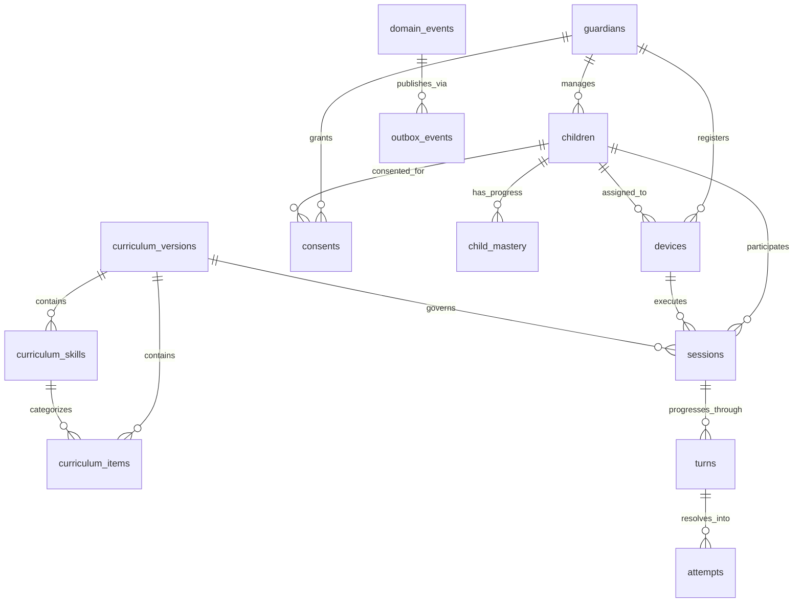

# Authoritative PostgreSQL Data Model & Dictionary

## 1. Overview & Architectural Principles

TOKI Smart Doll uses a single authoritative PostgreSQL database (`DATA-001`, `ADR-012`). In-memory process state is treated strictly as an ephemeral execution cache; all durable interaction, learning evidence, and consent decisions are anchored in PostgreSQL.

Key Architectural Guarantees:
- **Optimistic Concurrency (`DATA-002`):** Sessions use an integer `state_version` column. Concurrent updates or stale callbacks are rejected without mutating data.
- **Curriculum Immutability (`DATA-003`):** Approved curriculum versions (`curriculum_versions` with status `APPROVED`) are strictly immutable. Pedagogical modifications require an explicit version release.
- **Idempotency & Replay Prevention (`DATA-004`):** Every child attempt records a globally unique `message_id`. Duplicate attempts or replayed packets fail cleanly before mutating child mastery.
- **Append-Only Event Log & Atomic Outbox (`DATA-005`, `ADR-012`):** Every resolved turn writes `domain_events` and `outbox_events` atomically in the same database transaction. Domain events cannot be updated or deleted.
- **Data Minimization & Privacy (`DATA-006`, `DATA-008`, `DATA-009`, `ADR-013`):**
  - No exact dates of birth (DOB) are stored; coarse age bands (e.g., `4-5`, `6-8`) are used.
  - No raw audio waveforms, spectrograms, or video frames are stored in the normal operational schema.
  - Guardians use pseudonymous identifiers and hashed email references (`email_hash`).
- **Consent Revocation (`DATA-010`):** Revoked guardian consent blocks any subsequent session creation.
- **Provenance & Metadata Versioning (`DATA-007`):** The `version_metadata` table tracks active versions of curriculum, models, prompts, policies, thresholds, firmware, and releases.

---

## 2. Entity-Relationship Diagram



---

## 3. Data Dictionary

### 3.1 `guardians`
| Column | Type | Constraints | Description |
|---|---|---|---|
| `id` | VARCHAR(36) | PRIMARY KEY | Unique identifier (UUID). |
| `pseudonym` | VARCHAR(64) | NOT NULL | Pseudonymous display name (e.g. 'Bunda Rina'). |
| `email_hash` | VARCHAR(64) | NOT NULL, INDEX | SHA-256 hash of guardian email (`DATA-008`). |
| `created_at` | TIMESTAMPTZ | NOT NULL | UTC creation timestamp. |
| `updated_at` | TIMESTAMPTZ | NOT NULL | UTC last modification timestamp. |

### 3.2 `children`
| Column | Type | Constraints | Description |
|---|---|---|---|
| `id` | VARCHAR(36) | PRIMARY KEY | Unique identifier (UUID). |
| `guardian_id` | VARCHAR(36) | FK -> guardians.id (CASCADE) | Guardian managing this child. |
| `pseudonym` | VARCHAR(64) | NOT NULL | Pseudonymous child name (e.g. 'Adik Bintang'). |
| `age_band` | VARCHAR(16) | NOT NULL | Coarse age band ('4-5', '6-8') per `DATA-008`. |
| `created_at` | TIMESTAMPTZ | NOT NULL | UTC creation timestamp. |
| `updated_at` | TIMESTAMPTZ | NOT NULL | UTC last modification timestamp. |

### 3.3 `devices`
| Column | Type | Constraints | Description |
|---|---|---|---|
| `id` | VARCHAR(36) | PRIMARY KEY | Unique identifier (UUID). |
| `device_serial` | VARCHAR(64) | UNIQUE, INDEX | Unique hardware doll identifier (e.g. 'TOKI-DEV-001'). |
| `guardian_id` | VARCHAR(36) | FK -> guardians.id (SET NULL) | Associated guardian. |
| `child_id` | VARCHAR(36) | FK -> children.id (SET NULL) | Active child assigned to doll. |
| `firmware_version` | VARCHAR(32) | NOT NULL | Firmware version string (e.g. '1.0.0'). |
| `is_active` | BOOLEAN | NOT NULL | Whether device is authorized to connect. |
| `registered_at` | TIMESTAMPTZ | NOT NULL | Registration timestamp. |
| `last_seen_at` | TIMESTAMPTZ | NULLABLE | Last ping/heartbeat timestamp. |

### 3.4 `consents`
| Column | Type | Constraints | Description |
|---|---|---|---|
| `id` | VARCHAR(36) | PRIMARY KEY | Unique identifier (UUID). |
| `guardian_id` | VARCHAR(36) | FK -> guardians.id (CASCADE) | Consenting guardian. |
| `child_id` | VARCHAR(36) | FK -> children.id (CASCADE) | Subject child. |
| `consent_type` | VARCHAR(32) | NOT NULL | 'DATA_PROCESSING', 'VOICE_INTERACTION'. |
| `status` | VARCHAR(16) | NOT NULL | 'GRANTED', 'REVOKED' (`DATA-010`). |
| `granted_at` | TIMESTAMPTZ | NOT NULL | Consent timestamp. |
| `revoked_at` | TIMESTAMPTZ | NULLABLE | Revocation timestamp. |

### 3.5 `curriculum_versions`
| Column | Type | Constraints | Description |
|---|---|---|---|
| `id` | VARCHAR(36) | PRIMARY KEY | Unique identifier (UUID). |
| `version_token` | VARCHAR(64) | UNIQUE, INDEX | Semantic version token ('curriculum-v1.0'). |
| `status` | VARCHAR(16) | NOT NULL | 'DRAFT', 'APPROVED', 'ARCHIVED'. |
| `approved_by` | VARCHAR(64) | NULLABLE | Pedagogical reviewer ID (`DATA-003`). |
| `approved_at` | TIMESTAMPTZ | NULLABLE | Approval timestamp. |
| `created_at` | TIMESTAMPTZ | NOT NULL | Creation timestamp. |

### 3.6 `curriculum_skills`
| Column | Type | Constraints | Description |
|---|---|---|---|
| `id` | VARCHAR(36) | PRIMARY KEY | Unique identifier (UUID). |
| `curriculum_version_id` | VARCHAR(36) | FK -> curriculum_versions.id | Associated curriculum release. |
| `skill_token` | VARCHAR(64) | NOT NULL | Skill token (e.g. 'body_parts'). |
| `name` | VARCHAR(128) | NOT NULL | Display title (e.g. 'Mengenal Anggota Tubuh'). |
| `domain` | VARCHAR(64) | NOT NULL | Domain ('language', 'cognitive'). |
| `target_age_band` | VARCHAR(16) | NOT NULL | Target age band ('4-6'). |
| `created_at` | TIMESTAMPTZ | NOT NULL | Creation timestamp. |
| *Constraints* | | UNIQUE(curriculum_version_id, skill_token) | Unique per version. |

### 3.7 `curriculum_items`
| Column | Type | Constraints | Description |
|---|---|---|---|
| `id` | VARCHAR(36) | PRIMARY KEY | Unique identifier (UUID). |
| `curriculum_version_id` | VARCHAR(36) | FK -> curriculum_versions.id | Associated curriculum release. |
| `skill_id` | VARCHAR(36) | FK -> curriculum_skills.id | Parent skill. |
| `item_token` | VARCHAR(64) | NOT NULL | Item token (e.g. 'body_parts_mata'). |
| `prompt_text` | VARCHAR(255) | NOT NULL | Baseline prompt spoken to child. |
| `expected_answers` | JSON | NOT NULL | Array of valid expected answer strings. |
| `fallback_asset_id` | VARCHAR(64) | NOT NULL | Offline pre-recorded audio asset ID (`ADR-009`). |
| `created_at` | TIMESTAMPTZ | NOT NULL | Creation timestamp. |
| *Constraints* | | UNIQUE(curriculum_version_id, item_token) | Unique per version. |

### 3.8 `sessions`
| Column | Type | Constraints | Description |
|---|---|---|---|
| `id` | VARCHAR(36) | PRIMARY KEY | Unique identifier (UUID). |
| `device_id` | VARCHAR(36) | FK -> devices.id (RESTRICT) | Doll executing session. |
| `child_id` | VARCHAR(36) | FK -> children.id (RESTRICT) | Participating child. |
| `curriculum_version_id` | VARCHAR(36) | FK -> curriculum_versions.id | Curriculum version governing session. |
| `state` | VARCHAR(32) | NOT NULL | State machine status ('INITIALIZING', etc.). |
| `state_version` | INTEGER | NOT NULL, DEFAULT 1 | Optimistic concurrency token (`DATA-002`). |
| `current_turn_number` | INTEGER | NOT NULL, DEFAULT 0 | Active turn sequence. |
| `started_at` | TIMESTAMPTZ | NOT NULL | Session start timestamp. |
| `ended_at` | TIMESTAMPTZ | NULLABLE | Session termination timestamp. |
| `created_at` | TIMESTAMPTZ | NOT NULL | Creation timestamp. |
| `updated_at` | TIMESTAMPTZ | NOT NULL | Last update timestamp. |

### 3.9 `turns`
| Column | Type | Constraints | Description |
|---|---|---|---|
| `id` | VARCHAR(36) | PRIMARY KEY | Unique identifier (UUID). |
| `session_id` | VARCHAR(36) | FK -> sessions.id (CASCADE) | Parent session. |
| `turn_number` | INTEGER | NOT NULL | Turn sequence number (1, 2, ...). |
| `item_token` | VARCHAR(64) | NOT NULL | Active curriculum item. |
| `state_version` | INTEGER | NOT NULL | State version snapshot when turn started. |
| `status` | VARCHAR(16) | NOT NULL | 'PENDING', 'RESOLVED'. |
| `created_at` | TIMESTAMPTZ | NOT NULL | Turn start timestamp. |
| `resolved_at` | TIMESTAMPTZ | NULLABLE | Turn resolution timestamp. |
| *Constraints* | | UNIQUE(session_id, turn_number) | Strictly unique per session. |

### 3.10 `attempts`
| Column | Type | Constraints | Description |
|---|---|---|---|
| `id` | VARCHAR(36) | PRIMARY KEY | Unique identifier (UUID). |
| `turn_id` | VARCHAR(36) | FK -> turns.id (CASCADE) | Parent turn. |
| `message_id` | VARCHAR(64) | UNIQUE, INDEX | Idempotency key (`DATA-004`). |
| `is_correct` | BOOLEAN | NOT NULL | Assessment correctness outcome. |
| `reason_code` | VARCHAR(32) | NOT NULL | Assessment reason ('EXACT_MATCH', etc.). |
| `confidence` | FLOAT | NULLABLE | Normalized confidence score [0.0, 1.0]. |
| `spoken_text` | VARCHAR(255) | NULLABLE | Redacted transcript text (never raw audio). |
| `assistance_level` | VARCHAR(16) | NOT NULL | 'NONE', 'HINT', 'DIRECT_MODEL'. |
| `created_at` | TIMESTAMPTZ | NOT NULL | Creation timestamp. |

### 3.11 `child_mastery`
| Column | Type | Constraints | Description |
|---|---|---|---|
| `id` | VARCHAR(36) | PRIMARY KEY | Unique identifier (UUID). |
| `child_id` | VARCHAR(36) | FK -> children.id (CASCADE) | Child identifier. |
| `skill_token` | VARCHAR(64) | NOT NULL, INDEX | Skill identifier. |
| `mastery_band` | VARCHAR(16) | NOT NULL | 'INTRODUCED', 'PRACTICING', 'ACQUIRED'. |
| `practice_count` | INTEGER | NOT NULL, DEFAULT 0 | Total practice turns. |
| `success_count` | INTEGER | NOT NULL, DEFAULT 0 | Successful turns. |
| `last_attempt_at` | TIMESTAMPTZ | NULLABLE | Last attempt timestamp. |
| `updated_at` | TIMESTAMPTZ | NOT NULL | Last update timestamp. |
| *Constraints* | | UNIQUE(child_id, skill_token) | Exactly one progress record per skill. |

### 3.12 `domain_events`
| Column | Type | Constraints | Description |
|---|---|---|---|
| `id` | VARCHAR(36) | PRIMARY KEY | Unique identifier (UUID). |
| `session_id` | VARCHAR(36) | NULLABLE, INDEX | Session correlation. |
| `event_sequence` | INTEGER | NOT NULL | Monotonic sequence number. |
| `event_type` | VARCHAR(64) | NOT NULL, INDEX | Event category token. |
| `payload` | JSON | NOT NULL | Event data payload. |
| `privacy_class` | VARCHAR(32) | NOT NULL | 'OPERATIONAL', 'ANALYTICS'. |
| `created_at` | TIMESTAMPTZ | NOT NULL | Creation timestamp (append-only). |

### 3.13 `outbox_events`
| Column | Type | Constraints | Description |
|---|---|---|---|
| `id` | VARCHAR(36) | PRIMARY KEY | Unique identifier (UUID). |
| `event_id` | VARCHAR(36) | FK -> domain_events.id (CASCADE) | Originating domain event. |
| `topic` | VARCHAR(64) | NOT NULL, INDEX | Target event dispatch topic. |
| `payload` | JSON | NOT NULL | Event data payload. |
| `status` | VARCHAR(16) | NOT NULL, INDEX | 'PENDING', 'PUBLISHED', 'FAILED'. |
| `retry_count` | INTEGER | NOT NULL, DEFAULT 0 | Delivery retry attempts. |
| `created_at` | TIMESTAMPTZ | NOT NULL | Enqueue timestamp. |
| `published_at` | TIMESTAMPTZ | NULLABLE | Dispatch completion timestamp. |

### 3.14 `version_metadata`
| Column | Type | Constraints | Description |
|---|---|---|---|
| `id` | VARCHAR(36) | PRIMARY KEY | Unique identifier (UUID). |
| `component` | VARCHAR(32) | NOT NULL, INDEX | 'curriculum', 'model', 'prompt', 'policy', etc. |
| `version_token` | VARCHAR(64) | NOT NULL | Semantic version string. |
| `manifest` | JSON | NOT NULL | Full version parameters, hash, provenance. |
| `is_active` | BOOLEAN | NOT NULL, DEFAULT TRUE | Active release status. |
| `created_at` | TIMESTAMPTZ | NOT NULL | Registration timestamp. |
| *Constraints* | | UNIQUE(component, version_token) | Unique version token per component. |

---

## 4. Migration & Rollback Runbook (`DEV-003`)

### 4.1 Running Migrations
To upgrade the database to the latest migration head:
```bash
alembic upgrade head
```

To downgrade/rollback by one revision or to base:
```bash
# Rollback one revision
alembic downgrade -1

# Rollback to clean base
alembic downgrade base
```

### 4.2 Migration Strategy
1. **Additive Evolution:** All schema updates follow expand/migrate/contract patterns.
2. **Reversibility:** Every migration MUST define both `upgrade()` and `downgrade()` in reverse order.
3. **No Downtime:** Columns added in new releases MUST either have defaults or be nullable to maintain backward compatibility with previous application pods.
