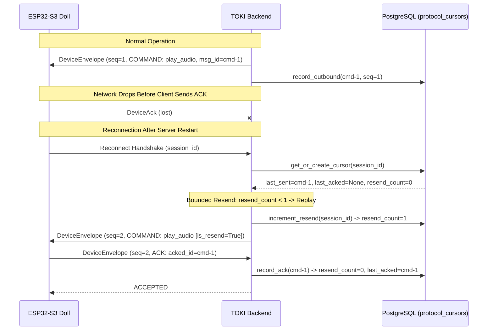

# TOKI Device Protocol Sequencing, Idempotency, and Recovery

**Status:** Normative Specification (E2 Core)  
**Requirement References:** FR-004, FR-005, DATA-002, DATA-004, API-006, SEC-004  
**Architecture References:** ADR-003, ADR-012  

---

## 1. Overview

The TOKI Smart Doll communication protocol connects the ESP32-S3 microcontroller to the backend orchestrator over WebSocket transport. Because physical wireless networks exhibit jitter, packet loss, reordering, and duplicate re-transmissions, the protocol is transport-neutral and guarantees:

1. **Monotonic Sequencing:** Every message carries an explicit sequence number (`seq >= 1`).
2. **Strict Idempotency:** Every message carries a unique `message_id`. Replayed messages produce an observable duplicate status without triggering repeated side effects.
3. **Durable Cursor Persistence:** Inbound/outbound sequences, acknowledged command IDs, and resend counters are committed to PostgreSQL / SQLite (`protocol_cursors` table), ensuring that server crashes and reconnects never lose track of state.
4. **Bounded Resend Rule:** Unacknowledged commands are resent at most once (`max_resends = 1`) before advancing to fallback or disconnection handling, preventing infinite playback loops.
5. **Session Expiry:** Expired sessions automatically reject inbound frames.

---

## 2. Protocol Framing

All control communication is wrapped in a versioned `DeviceEnvelope`:

```json
{
  "schema_version": "1.0",
  "protocol_version": "1.0",
  "message_id": "550e8400-e29b-41d4-a716-446655440000",
  "session_id": "sess-demo-001",
  "turn_id": "turn-1",
  "sequence_number": 1,
  "timestamp_ms": 1757241600000,
  "type": "COMMAND",
  "command": {
    "command_type": "play_audio",
    "parameters": {
      "asset_id": "audio_mata_001"
    }
  }
}
```

Envelope types (`EnvelopeType`):
- `COMMAND`: Server instructions sent to doll (e.g. `play_audio`, `display_eyes`, `move_arms`).
- `EVENT`: Hardware events sent by doll to server (e.g. `handshake`, `button_pressed`, `audio_end`).
- `ACK`: Acknowledgment confirming reception of a command frame.
- `AUDIO_METADATA`: Binary audio chunk header frame.

---

## 3. Reason Codes Catalog (`ProtocolReasonCode`)

| Code | Severity | Description | Action |
|---|---|---|---|
| `ACCEPTED` | Normal | Envelope is valid, in-sequence, and recorded. | Process payload. |
| `DUPLICATE_MESSAGE` | Warning | `message_id` already processed. | Drop payload; return cached outcome. |
| `OUT_OF_ORDER_SEQUENCE` | Error | Sequence number `<= last_inbound_seq`. | Drop packet; request resynchronization. |
| `SEQUENCE_GAP` | Error | Sequence number `> last_inbound_seq + 1`. | Request missing packets or resync. |
| `STALE_STATE_VERSION` | Error | Callback carries obsolete `state_version`. | Discard without advancing FSM. |
| `STALE_TURN` | Error | Callback carries obsolete `turn_id`. | Discard without advancing FSM. |
| `SESSION_EXPIRED` | Error | Session exceeded TTL window. | Close connection; require restart. |
| `SESSION_NOT_FOUND` | Error | Unknown `session_id`. | Close connection. |
| `SESSION_TERMINAL` | Error | Session in `COMPLETED` or `SESSION_ABORTED`. | Reject event. |
| `MAX_RESENDS_EXCEEDED` | Warning | Outbound command resent maximum allowed times. | Transition to fallback/disconnect. |
| `ACK_MISMATCH` | Error | ACK message ID does not match pending command. | Log error and audit. |

---

## 4. Reconnect & Resume Sequence



---

## 5. Idempotency & Replay Invariants

1. **No State Mutation on Duplicate:** Re-transmitting an already processed `message_id` returns `valid=False, is_duplicate=True` and produces zero database updates.
2. **Single Bounded Resend:** Reconnecting without an ACK allows exactly one resend. If reconnection occurs a second time without an ACK, `resend_count >= 1` and `pending_command` is withheld (`MAX_RESENDS_EXCEEDED`).
3. **Crash Recovery Parity:** Because cursor state is written to the database, a server process crash and cold restart can resume from the exact last acknowledged state without requiring in-memory session caches.
