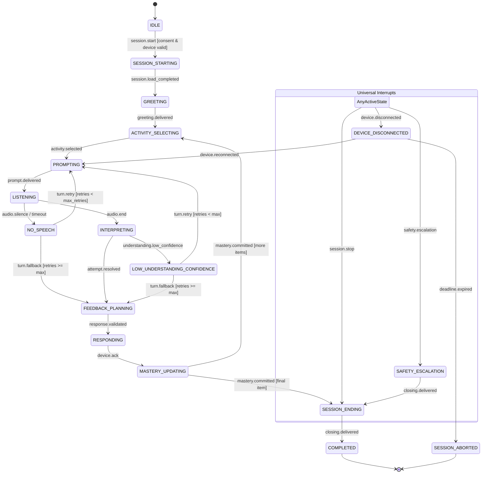

# Session Finite-State Machine & Orchestration Control Plane

**Status:** Normative Specification (E2 Core)  
**Requirement References:** FR-001, FR-002, FR-003, FR-005, FR-010, FR-012, FR-022, REL-001, ADR-003  

## 1. Overview

The TOKI Smart Doll runtime uses an explicit, deterministic finite-state machine (FSM) to control session lifecycles. In accordance with **ADR-003**, there are **zero autonomous runtime agents** in the child interaction loop. Only the `SessionOrchestrator` possesses the authority to advance session states, enforce guards, manage turn counters, and commit state updates to PostgreSQL.

External AI providers (ASR, TTS, Semantic, Paraphraser, Vision) act purely as evidence suppliers. Any asynchronous callback arriving from a provider or device must supply a `CallbackCorrelation` carrying `session_id`, `turn_id`, and `state_version`. If the `state_version` does not match the active session version, the callback is treated as stale and discarded without side effects (**FR-002**).

---

## 2. State & Event Vocabulary

### 2.1 States (`SessionState`)

| State | Category | Description |
|---|---|---|
| `IDLE` | Lifecycle | Unbound session state before start. |
| `SESSION_STARTING` | Lifecycle | Verifying device authentication and guardian consent. |
| `GREETING` | Lifecycle | Delivering initial welcome and audio handshake. |
| `ACTIVITY_SELECTING` | Lifecycle | Selecting approved curriculum item. |
| `PROMPTING` | Lifecycle | Presenting question or instructions to the child. |
| `LISTENING` | Lifecycle | Audio ingestion active; waiting for child response. |
| `INTERPRETING` | Lifecycle | Evaluating child input through deterministic rules/semantics. |
| `FEEDBACK_PLANNING` | Lifecycle | Selecting pedagogical act, hints, or praise. |
| `RESPONDING` | Lifecycle | Delivering feedback audio or gestures to doll. |
| `MASTERY_UPDATING` | Lifecycle | Recording attempt, updating mastery, emitting domain events. |
| `SESSION_ENDING` | Lifecycle | Delivering closing interaction or exit prompt. |
| `COMPLETED` | Terminal | Clean session termination. Rejects further events. |
| `NO_SPEECH` | Exception | Silence or timeout detected during `LISTENING`. |
| `LOW_UNDERSTANDING_CONFIDENCE` | Exception | Ambiguous answer unable to be resolved with confidence. |
| `CONTENT_ERROR` | Exception | Missing curriculum item or corrupt asset. |
| `SAFETY_ESCALATION` | Exception | High-severity safety trigger (overrides curriculum). |
| `DEVICE_DISCONNECTED` | Exception | Physical ESP32 link dropped; awaiting reconnect. |
| `DEPENDENCY_DEGRADED` | Exception | Optional cloud provider unavailable; using offline cache. |
| `SESSION_ABORTED` | Terminal | Unrecoverable disconnect or error. Rejects further events. |

---

## 3. State Machine Flow

---

## 4. Transition Matrix

| Current State | Accepted Event | Guard / Condition | Next State | Timeout / Fallback |
|---|---|---|---|---|
| `IDLE` | `session.start` | `authenticated` & `consent_active` | `SESSION_STARTING` | Deny if consent revoked |
| `SESSION_STARTING` | `session.load_completed` | Approved curriculum available | `GREETING` | `CONTENT_ERROR` |
| `GREETING` | `greeting.delivered` | None | `ACTIVITY_SELECTING` | Advance on timeout |
| `ACTIVITY_SELECTING` | `activity.selected` | Item valid | `PROMPTING` | Default activity on timeout |
| `ACTIVITY_SELECTING` | `session.finished` | All activities done | `SESSION_ENDING` | Immediate |
| `PROMPTING` | `prompt.delivered` | Audio delivered | `LISTENING` | Cached prompt fallback |
| `LISTENING` | `audio.end` | Valid audio received | `INTERPRETING` | `NO_SPEECH` on silence |
| `INTERPRETING` | `attempt.resolved` | Answer evaluated | `FEEDBACK_PLANNING` | `LOW_UNDERSTANDING_CONFIDENCE` |
| `FEEDBACK_PLANNING` | `response.validated` | Text <= 25 words & reviewed | `RESPONDING` | Canned template fallback |
| `RESPONDING` | `device.ack` | Spoken audio acknowledged | `MASTERY_UPDATING` | Resend or advance |
| `MASTERY_UPDATING` | `mastery.committed` | `is_final_activity == True` | `SESSION_ENDING` | Proceed to next activity |
| `MASTERY_UPDATING` | `mastery.committed` | `is_final_activity == False` | `ACTIVITY_SELECTING` | Loop next turn |
| `SESSION_ENDING` | `closing.delivered` | None | `COMPLETED` | Immediate |
| `NO_SPEECH` | `turn.retry` | `turn_retry_count < max_retries` | `PROMPTING` | Child-friendly retry |
| `NO_SPEECH` | `turn.fallback` | `turn_retry_count >= max_retries` | `FEEDBACK_PLANNING` | Hint/choice demonstration |
| `LOW_UNDERSTANDING_CONFIDENCE` | `turn.retry` | `turn_retry_count < max_retries` | `PROMPTING` | Child-friendly retry |
| `LOW_UNDERSTANDING_CONFIDENCE` | `turn.fallback` | `turn_retry_count >= max_retries` | `FEEDBACK_PLANNING` | Hint/choice demonstration |
| `SAFETY_ESCALATION` | `closing.delivered` | Immediate reviewed message | `SESSION_ENDING` | Immediate |
| `DEVICE_DISCONNECTED` | `device.reconnected` | Link restored within deadline | Last durable state | Resume playback/prompt |
| `DEVICE_DISCONNECTED` | `deadline.expired` | Reconnect window elapsed | `SESSION_ABORTED` | Terminal termination |
| **Any Active State** | `session.stop` | Valid stop trigger | `SESSION_ENDING` | Immediate exit (FR-022) |
| **Any Active State** | `safety.escalation` | Deterministic safety rule | `SAFETY_ESCALATION` | Immediate exit (FR-012) |

---

## 5. Architectural Invariants

1. **Deterministic Bounded Exits (REL-001):** Every active state provides a path via normal transition, timeout, fallback, or stop. No state can result in a terminal hang.
2. **Single Child-Friendly Retry (FR-010):** When silence or low confidence occurs, `turn_retry_count` is incremented. Exactly one retry is permitted before forcing a fallback to `FEEDBACK_PLANNING`.
3. **Universal Stop Guarantee (FR-022, SEC-009):** A guardian or physical doll stop request from any active state immediately moves the system to `SESSION_ENDING` -> `COMPLETED`.
4. **Stale Callback Protection (FR-002, ADR-003):** If a late ASR hypothesis or CV observation carries a `state_version` different from `session.state_version`, it is rejected with `StaleCallbackError`.
5. **Optimistic Concurrency Persistence (DATA-002):** State transitions are written to the database using `SessionRepository.advance_state(session_id, expected_state_version, new_state)`. A concurrent write clash raises `OptimisticLockError`.
