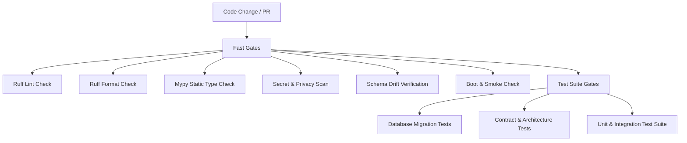

# Testing and Quality Gate Guide

This document defines the automated quality gates, test execution guidelines, local reproduction commands, and flake management policies for the TOKI Smart Doll repository, satisfying **DEV-002**, **DEV-005**, **DEV-006**, and **ADR-015**.

---

## 1. Quality Gate Architecture

To ensure fast developer feedback while preventing regressions, the CI pipeline and local runner are structured into staged gates:



### Staging Principle

1. **Fast Gates (Static & Sanity):**
   - Execute in under 10 seconds.
   - Fail immediately before spinning up database migrations or large test fixtures.
   - Include linting, formatting, type checking, secret/privacy scanning, OpenAPI/JSON schema drift verification, and FastAPI app boot smoke tests.

2. **Test Suite Gates (Deterministic Behavior):**
   - Execute database migration forward and backward verification.
   - Execute strict contract and architectural boundary checks (`tests/contracts/`).
   - Execute complete unit and integration test suite across core domains (curriculum, session, audio, vision, analytics, telemetry).

---

## 2. Local Execution

Developers and automated agents must run the 1-to-1 local equivalent of CI before committing or pushing changes.

### Complete Quality Gate Runner

Run all 9 stages in sequence:

```powershell
python scripts/run_quality_gates.py
```

Optional flags:
- `--fast-only`: Run only the static fast gates (stages 1–6).
- `--tests-only`: Run only the test suite stages (stages 7–9).
- `--fail-fast`: Abort immediately upon first stage failure.

### Individual Stage Commands

| Gate / Check | Local Command | Description |
|---|---|---|
| **1. Ruff Lint** | `ruff check app tests simulators alembic scripts` | Checks code style, unused imports, PEP8 conventions (`DEV-002`). |
| **2. Ruff Format** | `ruff format --check app tests simulators alembic scripts` | Ensures deterministic code formatting across all modules. |
| **3. Mypy Typing** | `mypy app simulators tests scripts` | Strict static type checking with zero untyped defs allowed (`DEV-002`). |
| **4. Secret & Privacy Scan** | `python scripts/scan_secrets.py` | Scans repository for secrets (`sk-`, `AKIA`, private keys) and raw child media (`SEC-007`). |
| **5. Schema Drift** | `python scripts/export_schemas.py --check` | Verifies generated contract schemas match current Pydantic models (`ADR-015`). |
| **6. Boot Smoke Check** | `python scripts/smoke_check.py` | Validates FastAPI application boots cleanly and responds to `/health/live` (`DEV-005`). |
| **7. Migration Tests** | `pytest tests/integration/test_migrations.py -v` | Validates Alembic schema migrations apply cleanly on clean SQLite DB (`DATA-001`). |
| **8. Contract Tests** | `pytest tests/contracts/ -v` | Validates inter-service and external schema boundaries (`DEV-006`). |
| **9. Unit/Integration Tests** | `pytest tests/unit/ tests/integration/ -v` | Complete deterministic behavior test suite with in-memory SQLite/fakes. |

---

## 3. Determinism & Isolation Policy

All standard CI and local quality gate runs strictly enforce:
- **No Live Provider Credentials:** Standard tests must **never** require live OpenAI, Anthropic, ElevenLabs, or cloud credentials.
- **Deterministic Fakes:** All external audio, vision, and semantic dependencies are mocked or simulated via deterministic fakes (`simulators/` and `tests/fakes/`).
- **In-Memory / Ephemeral DB:** Tests execute with `PROFILE=test` using in-memory or ephemeral SQLite instances.
- **Network Isolation:** Tests must not make external HTTP/network calls.

---

## 4. Flake Quarantine Policy

Flaky tests degrade agent velocity and developer trust. The repository enforces a strict, zero-tolerance flake management policy:

1. **Detection:**
   - Any test that fails non-deterministically without code changes is flagged as flaky.
2. **Immediate Quarantine:**
   - Flaky tests must not be left intermittently failing in the main test path.
   - To quarantine a test, apply the `@pytest.mark.quarantine` decorator and document:
     - Issue / ticket ID
     - Owner responsible for root-cause fix
     - Expiration date (maximum 7 days from quarantine)
3. **Quarantine Execution:**
   - Standard CI excludes quarantined tests: `pytest -m "not quarantine"`.
   - A dedicated quarantine evaluation job monitors quarantined tests.
4. **Current Status:**
   - **Quarantined Tests:** `0` (Zero quarantined tests as of TASK-006 baseline).
   - All 186 automated tests pass deterministically.

---

## 5. Measured Baseline Durations

Baseline measured on local reference environment (Windows 11, Python 3.12, AMD/Intel x86_64):

| Stage | Name | Target Duration | Baseline Duration |
|---|---|---|---|
| 1 | Ruff Lint Check | < 5.0s | 2.16s |
| 2 | Ruff Format Check | < 2.0s | 0.58s |
| 3 | Mypy Static Type Check | < 5.0s | 1.68s |
| 4 | Secret & Privacy Scan | < 3.0s | 0.91s |
| 5 | Schema Drift Verification | < 2.0s | 0.74s |
| 6 | Boot & Smoke Check | < 3.0s | 1.57s |
| 7 | Database Migration Tests | < 5.0s | 3.20s |
| 8 | Contract & Architecture Tests | < 4.0s | 2.43s |
| 9 | Unit & Integration Suite | < 15.0s | 9.29s |
| **Total** | **All Quality Gates** | **< 45.0s** | **22.56s** |
