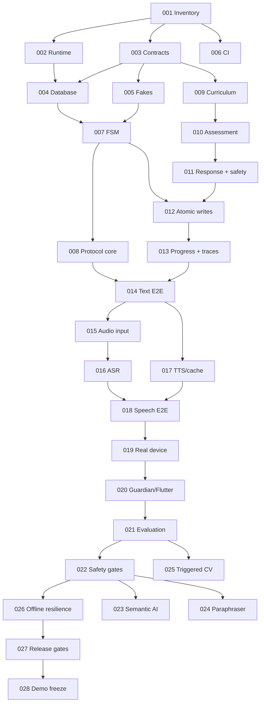

# Engineering Task Index

## Status Legend

| Status | Meaning |
|---|---|
| `TODO` | Defined but prerequisites or scheduling are not ready. |
| `READY` | Dependencies satisfied; an agent may claim it. |
| `IN_PROGRESS` | Exactly one primary owner is actively working. |
| `BLOCKED` | Cannot proceed safely; blocker is recorded in task and handoff. |
| `REVIEW` | Implementation complete; independent validation pending. |
| `DONE` | Definition of Done and acceptance evidence independently verified. |

## Priority Legend

| Priority | Meaning |
|---|---|
| `P0` | Critical to the reliable competition demo. |
| `P1` | High impact; ship only after P0 path is stable. |
| `P2` | Useful optimization/integration that may be deferred. |
| `P3` | Optional/post-competition. |

## Active Milestone

**Milestone M0 — Repository and contract foundation.** Start with TASK-001. Target exit: reproducible service, versioned contracts, database migrations, deterministic fakes/simulators, and mandatory CI gates.

## Minimum Demo Path

The smallest end-to-end competition path is:

`001 → {002,003,006} → {004,005} → {007,009} → {008,010} → 011 → 012 → 013 → 014 → {015,017} → 016 → 018 → 019 → 020 → 021 → 022 → 026 → 027 → 028`

Braces indicate work that can overlap once its own dependencies are satisfied. TASK-023, TASK-024, and TASK-025 are excluded unless their evidence gates pass.

## Task Table

| ID | Task | Epic | Priority | Status | Dependencies | Relevant Requirements | Recommended Agent Capability |
|---|---|---|---|---|---|---|---|
| [TASK-001](TASK-001.md) | Inventory repository and map boundaries | E1 Foundation | P0 | DONE | None | DEV-001, DEV-002 | repository_inspection, architecture_review, documentation |
| [TASK-002](TASK-002.md) | Establish reproducible runtime profiles | E1 Foundation | P0 | DONE | 001 | DEV-001, API-003, API-007, REL-006 | infrastructure, backend, testing |
| [TASK-003](TASK-003.md) | Freeze versioned domain and API contracts | E1 Foundation | P0 | DONE | 001 | API-001, API-002, API-004–006, AI-002 | backend, architecture_review, testing |
| [TASK-004](TASK-004.md) | Create PostgreSQL schema and migrations | E1 Foundation | P0 | DONE | 002,003 | DATA-001–005,007–010, DEV-003 | backend, database, testing |
| [TASK-005](TASK-005.md) | Add provider interfaces, fakes, and simulators | E1 Foundation | P0 | DONE | 003 | AI-001–003,006, DEV-004 | backend, AI_ML, testing |
| [TASK-006](TASK-006.md) | Enforce CI and repository quality gates | E1 Foundation | P0 | DONE | 001 | DEV-002, DEV-005, DEV-006 | infrastructure, testing, documentation |
| [TASK-007](TASK-007.md) | Implement deterministic session state machine | E2 Deterministic Core | P0 | DONE | 003,004,005 | FR-001, FR-002, FR-010, FR-022, REL-001 | backend, testing, architecture_review |
| [TASK-008](TASK-008.md) | Implement protocol sequencing and resume core | E2 Deterministic Core | P0 | DONE | 003,004,007 | FR-004, FR-005, DATA-002,004, API-006, SEC-004 | backend, debugging, testing |
| [TASK-009](TASK-009.md) | Implement approved curriculum access | E2 Deterministic Core | P0 | DONE | 003,004 | FR-006, FR-007, DATA-003 | backend, database, testing |
| [TASK-010](TASK-010.md) | Implement deterministic answer assessment | E2 Deterministic Core | P0 | DONE | 003,009 | FR-008–010, AI-005, OBS-005 | backend, AI_ML, testing |
| [TASK-011](TASK-011.md) | Implement response planning and core safety | E2 Deterministic Core | P0 | DONE | 003,009,010 | FR-011–013, SEC-005, SEC-009 | backend, security, testing |
| [TASK-012](TASK-012.md) | Persist attempts, mastery, events, and outbox atomically | E2 Deterministic Core | P0 | DONE | 004,007,010,011 | FR-014, FR-015, DATA-004,005 | backend, database, testing |
| [TASK-013](TASK-013.md) | Build progress projection and turn observability | E2 Deterministic Core | P0 | DONE | 012 | FR-016, FR-017, FR-021, OBS-001–005 | backend, data, testing |

| [TASK-014](TASK-014.md) | Prove deterministic end-to-end vertical slice | E2 Deterministic Core | P0 | READY | 005–013 | REL-005, DEV-002, EVAL-001 | testing, backend, evaluation |
| [TASK-015](TASK-015.md) | Implement bounded audio ingestion | E3 Speech Baseline | P0 | TODO | 003,008,014 | API-002, SEC-003, DATA-006 | backend, testing, security |
| [TASK-016](TASK-016.md) | Benchmark and integrate ASR adapter | E3 Speech Baseline | P0 | TODO | 005,015 | AI-004–006, DATA-006, EVAL-002 | AI_ML, backend, evaluation |
| [TASK-017](TASK-017.md) | Implement cache-first Indonesian audio rendering | E3 Speech Baseline | P0 | TODO | 005,011,014 | FR-013, REL-007, AI-006 | backend, AI_ML, testing |
| [TASK-018](TASK-018.md) | Prove spoken activity, latency, and privacy | E3 Speech Baseline | P0 | TODO | 013,015–017 | REL-008, OBS-001–004, SEC-007 | evaluation, backend, testing |
| [TASK-019](TASK-019.md) | Integrate authenticated real-device gateway | E4 Integration | P0 | TODO | 008,018 | FR-003–005,022, SEC-002,004 | backend, integration, debugging |
| [TASK-020](TASK-020.md) | Integrate guardian consent and Flutter progress API | E4 Integration | P0 | TODO | 013,019 | FR-003,016, DATA-008–010, SEC-001,008 | backend, security, integration |
| [TASK-021](TASK-021.md) | Freeze evaluation datasets, replay, and scorecards | E5 Evidence | P0 | TODO | 018,020 | EVAL-001–006, REL-009 | evaluation, AI_ML, testing |
| [TASK-022](TASK-022.md) | Enforce safety and failure regression gates | E5 Evidence | P0 | TODO | 019,021 | SEC-005–010, REL-001–005, EVAL-002 | security, evaluation, testing |
| [TASK-023](TASK-023.md) | Evaluate bounded semantic resolver | E6 Optional AI | P1 | TODO | 021,022 | FR-018, AI-007, EVAL-005 | AI_ML, evaluation, backend |
| [TASK-024](TASK-024.md) | Evaluate constrained response paraphraser | E6 Optional AI | P1 | TODO | 021,022 | FR-019, AI-008, EVAL-005 | AI_ML, security, evaluation |
| [TASK-025](TASK-025.md) | Integrate and evaluate triggered bounded CV | E6 Optional AI | P2 | TODO | 003,019,021 | FR-020, AI-009, DATA-006 | AI_ML, integration, evaluation |
| [TASK-026](TASK-026.md) | Implement offline and provider-failure resilience | E7 Reliability | P0 | TODO | 018,022 | REL-002–007, API-007 | backend, infrastructure, debugging |
| [TASK-027](TASK-027.md) | Pass security, replay, soak, and parity gates | E7 Reliability | P0 | TODO | 020,022,026 | REL-006,009,010, SEC-001–009 | testing, security, infrastructure |
| [TASK-028](TASK-028.md) | Freeze release and rehearse competition demo | E8 Demo | P0 | TODO | 020–022,027 | REL-011, EVAL-006, DEV-002 | infrastructure, evaluation, documentation |

## Dependency Graph

## Critical Path

The demo-critical sequence is foundation → deterministic text activity → spoken activity → real device/guardian integration → frozen evaluation and safety → offline resilience → release rehearsals. TASK-006 begins in parallel but its checks become mandatory as each related capability lands.

External schedule blockers are the hardware audio/protocol contract for TASK-019, approved curriculum content for TASK-009/011, consented/device-like audio for TASK-016, and reviewer availability for TASK-021/022. Start coordination while foundation work runs.

## Parallelizable Work

- After TASK-001: TASK-002, TASK-003, and TASK-006.
- After TASK-003: TASK-005 and contract fixture preparation for TASK-009/015.
- After TASK-004/005: TASK-007 and TASK-009.
- After TASK-014: TASK-015 and TASK-017.
- After TASK-022: TASK-023, TASK-024, and TASK-026; optional AI must not delay TASK-026.
- TASK-025 can run beside reliability work when the CV team and dataset are ready.

Only one agent should edit an overlapping core module at a time. Parallel work must use frozen contracts and consumer fixtures.

## Deferred / Optional Work

- TASK-023 semantic resolver: promote only after ≥5 percentage-point absolute ambiguous-turn completion gain with no safety/latency regression.
- TASK-024 paraphraser: promote only with 100% schema/provenance/safety gate and p95 budget maintained.
- TASK-025 triggered CV: exclude from the core speech demo unless per-class/unknown-rejection evidence passes.
- pgvector/RAG, ASR fine-tuning, BKT, attention proxy, multiple modules, autonomous agents, microservices, Kafka, Kubernetes, and full offline parity are not scheduled for the competition baseline.